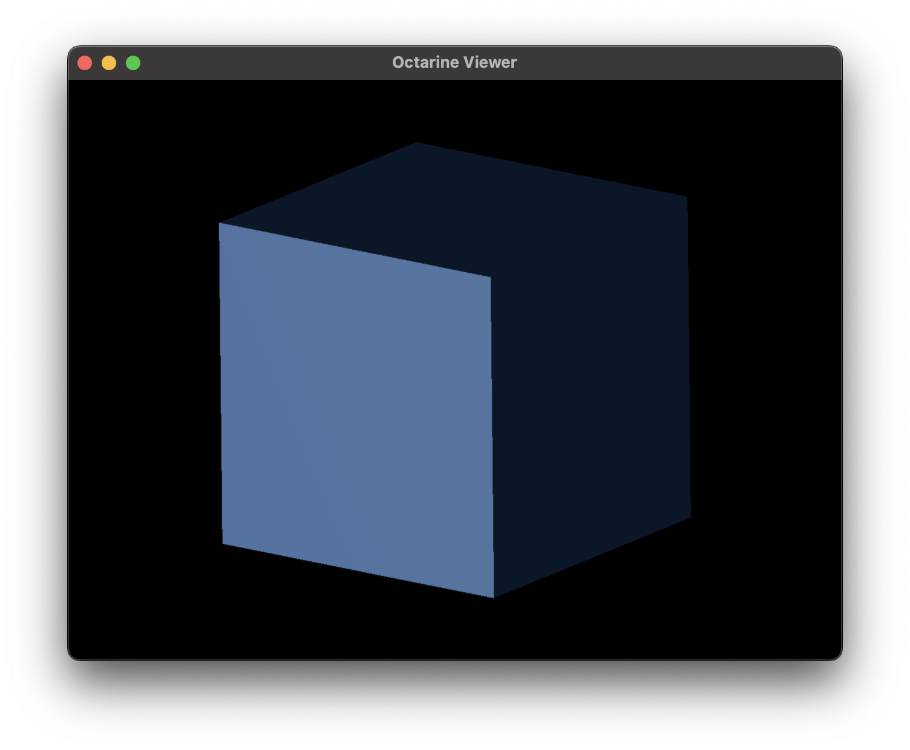
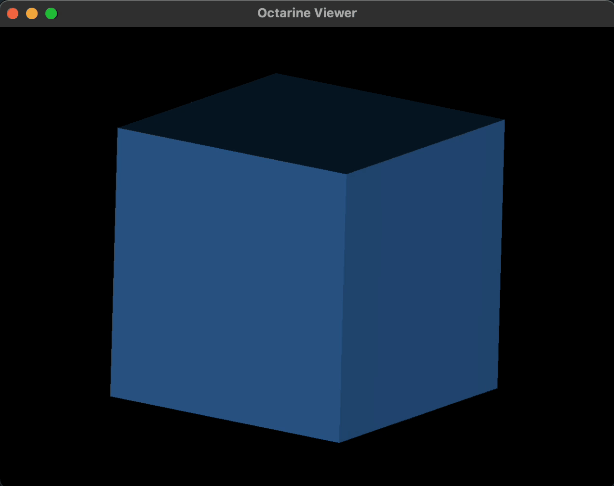

# Animations

[`octarine.Viewer`][] makes it easy to add simple animations:

```python
>>> import octarine as oc
>>> import pygfx as gfx

>>> # Generate a simple cube
>>> cube = gfx.Mesh(
...     gfx.box_geometry(200, 200, 200),
...     gfx.MeshPhongMaterial(color="#336699"),
... )

>>> # Initialize the viewer and add the cube
>>> v = Viewer()
>>> v.add(cube)
```

At this point not much is happening:



Next, we will use [`octarine.Viewer.add_animation`][] to add a function
that will rotate the cube:

```python
>>> import math
>>> def rotate_cube():
...     """Increment the rotation of the cube."""
...     cube.local.euler_y = (cube.local.euler_y + 0.05) % (math.pi / 2)

>>> v.add_animation(rotate_cube)
```


So what's happening here? The `rotate_cube()` function is now being called _before_
each frame is rendered.

Importantly, this also means that the speed of the
rotation is tied to the frame rate of our viewer. By default, the frames per
second is capped at 30. Try increasing that cap and you should see the
cube rotate faster:

```python
>>> v.max_fps = 60
```

You could decouple the rotation from the frame rate by incrementing the rotation
depending no how much time has passed since the last call.
