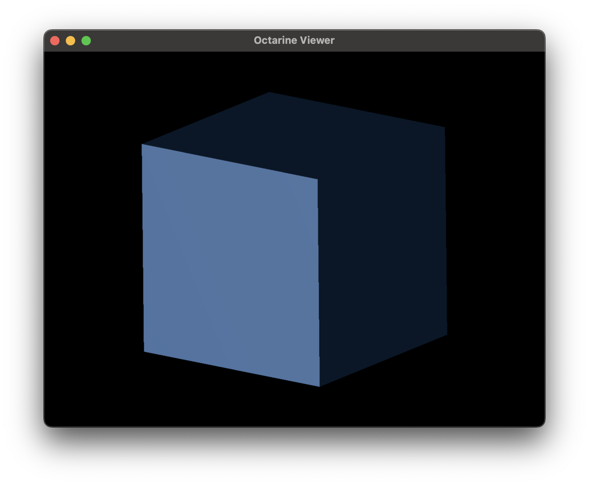
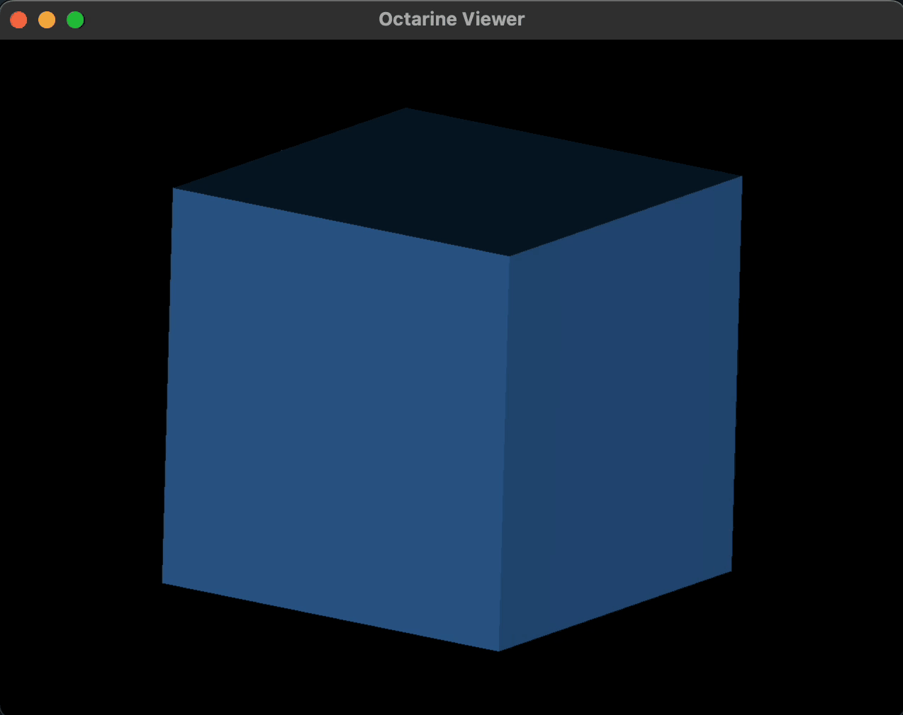

# Animations

[`octarine.Viewer`][] makes it easy to add simple animations:

```python
>>> import octarine as oc
>>> import pygfx as gfx

>>> # Generate a simple cube
>>> cube = gfx.Mesh(
...     gfx.box_geometry(200, 200, 200),
...     gfx.MeshPhongMaterial(color="#336699"),
... )

>>> # Initialize the viewer and add the cube
>>> v = Viewer()
>>> v.add(cube)
```

At this point not much is happening:



Next, we will use [`octarine.Viewer.add_animation`][]`()` to add a function
that will rotate the cube:

```python
>>> import math
>>> def rotate_cube():
...     """Increment the rotation of the cube."""
...     cube.local.euler_y = (cube.local.euler_y + 0.05) % (math.pi / 2)

>>> v.add_animation(rotate_cube)
```


So what's happening here? The `rotate_cube()` function is now being called _before_
each frame is rendered.

Importantly, this also means that the speed of the
rotation is tied to the frame rate of our viewer. By default, the frames per
second is capped at 30. Try increasing that cap and you should see the
cube rotate faster:

```python
>>> v.max_fps = 60
```

You could decouple the rotation from the frame rate by incrementing the rotation
depending on how much time has passed since the last call.

A few useful options of [`octarine.Viewer.add_animation`][]`()`:

- `on_error` determines what happens when your function raises an exception:
  `"remove"` (default) drops it from the animation loop, `"log"` logs the
  error and keeps going, `"ignore"` silently continues and `"raise"` lets
  the exception bubble up
- `run_every=N` calls the function only every `N` frames
- `req_render=False` tells the viewer that the function does not change the
  scene - relevant when using a `"reactive"` [render trigger](triggers.md)

Use [`octarine.Viewer.remove_animation`][]`()` to remove a function from the
animation loop again.

## Recording videos

The `octarine.video_helpers` module contains functions to record the viewer
to a video file. Currently there is just one:
[octarine.video_helpers.make_rotation_video][], which rotates the camera
once around the scene:

```python
>>> from octarine.video_helpers import make_rotation_video

>>> # Record a 100-frame rotation around the z-axis
>>> make_rotation_video(v, "rotation.mp4", n_frames=100, fps=30, axis="z")
```

With `video_path=None` the frames are returned as a list of numpy arrays
instead of being written to file.

!!! note

    This requires `scipy` and `tqdm`, plus `imageio` if you want to write
    the video to file (`pip install imageio scipy tqdm`).

## What next?

<div class="grid cards" markdown>

-   :material-cube:{ .lg .middle } __Objects__

    ---

    Check out the guide on different object types.

    [:octicons-arrow-right-24: Adding Objects](objects.md)

-   :material-camera-control:{ .lg .middle } __Control__

    ---

    Learn how to control the viewer, adjust colors, etc.

    [:octicons-arrow-right-24: Controls](controls.md)

</div>