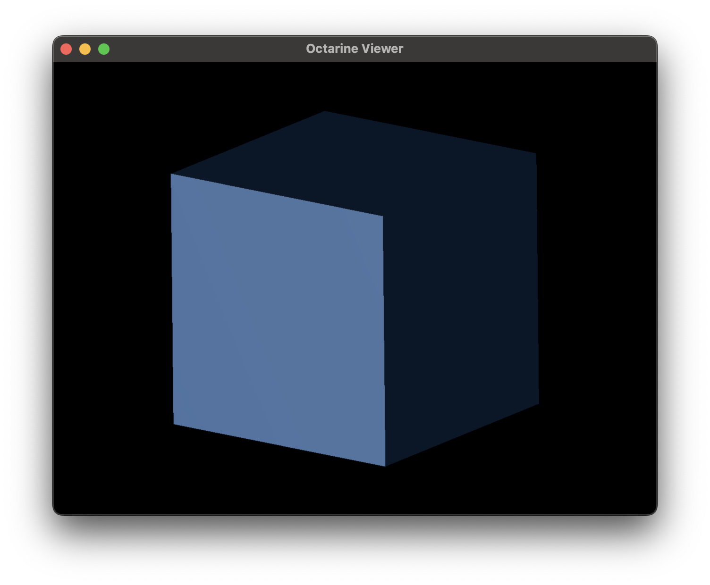
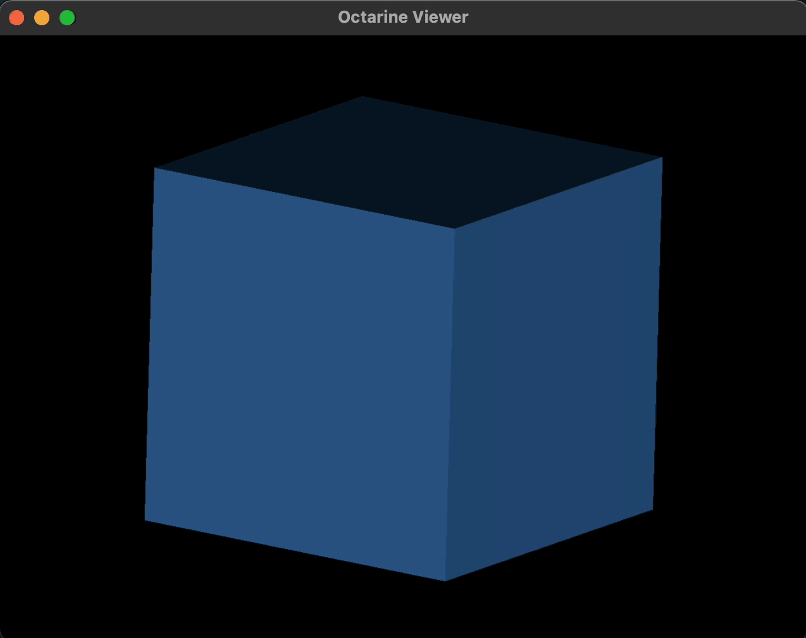

# Animations

[`octarine.Viewer`][] makes it easy to add simple animations:

```python
>>> import octarine as oc
>>> import pygfx as gfx

>>> # Generate a simple cube
>>> cube = gfx.Mesh(
...     gfx.box_geometry(200, 200, 200),
...     gfx.MeshPhongMaterial(color="#336699"),
... )

>>> # Initialize the viewer and add the cube
>>> v = Viewer()
>>> v.add(cube)
```

At this point not much is happening:



Next, we will use [`octarine.Viewer.add_animation`][]`()` to add a function
that will rotate the cube:

```python
>>> import math
>>> def rotate_cube():
...     """Increment the rotation of the cube."""
...     cube.local.euler_y = (cube.local.euler_y + 0.05) % (math.pi / 2)

>>> v.add_animation(rotate_cube)
```


So what's happening here? The `rotate_cube()` function is now being called _before_
each frame is rendered.

Importantly, this also means that the speed of the
rotation is tied to the frame rate of our viewer. By default, the frames per
second is capped at 30. Try increasing that cap and you should see the
cube rotate faster:

```python
>>> v.max_fps = 60
```

You could decouple the rotation from the frame rate by incrementing the rotation
depending on how much time has passed since the last call.

A few useful options of [`octarine.Viewer.add_animation`][]`()`:

- `on_error` determines what happens when your function raises an exception:
  `"remove"` (default) drops it from the animation loop, `"log"` logs the
  error and keeps going, `"ignore"` silently continues and `"raise"` lets
  the exception bubble up
- `run_every=N` calls the function only every `N` frames
- `req_render=False` tells the viewer that the function does not change the
  scene - relevant when using a `"reactive"` [render trigger](triggers.md)

Use [`octarine.Viewer.remove_animation`][]`()` to remove a function from the
animation loop again.

## Camera animations

`add_animation()` is the low-level hook - you write a function and it runs
before every frame. For the most common job, moving the *camera* and saving
the result as a video, use [`octarine.Animation`][] instead:

```python
>>> anim = oc.Animation(v)
>>> anim.orbit(duration=6)          # one turn around the scene, over 6 seconds
>>> anim.render("orbit.mp4")
```

An `Animation` is a timeline that you fill with segments. Each one picks up
where the previous one left off, so a timeline reads much like the animation
itself:

```python
>>> anim = oc.Animation(v, fps=60)
>>> anim.orbit("neuron_1", turns=1, duration=6)  # circle one object
>>> anim.move_to("XZ", duration=2)               # swing round to the lateral view
>>> anim.hold(1)                                 # ... and stay there a second
>>> anim.zoom(2, duration=2)                     # zoom in on it
>>> anim.render("tour.mp4")
```

Every method returns the animation, so the above can also be chained.

### Orbits

[`Animation.orbit`][octarine.Animation.orbit] circles the camera around
object(s):

```python
>>> # Everything on the viewer, twice, clockwise
>>> anim.orbit(turns=-2, duration=10)

>>> # Just these two objects (as named in the legend)
>>> anim.orbit(["neuron_1", "neuron_2"], duration=6)
```

By default the camera is re-centered on the target before the orbit starts and
rotates about the scene's up direction - a turntable. Two knobs change that:

- `axis` takes `"up"` (default), `"x"`, `"y"`, `"z"`, `"view"` (i.e. a roll) or
  any vector; prefix with `-` to flip the direction
- `recenter=False` keeps the view exactly as it is and orbits around whatever
  the camera is already looking at - use this when you have set up a view by
  hand and just want to spin it

### Moving between views

[`Animation.move_to`][octarine.Animation.move_to] takes anything
[`Viewer.set_view`][octarine.Viewer.set_view] takes - a named view such as
`"XY"`, or a camera state from [`Viewer.get_view`][octarine.Viewer.get_view].
That last one is the interesting bit: navigate the scene by hand, grab the
view, and use it as a waypoint.

```python
>>> v.set_view("XY")
>>> start = v.get_view()
>>> # ... now move the camera around in the viewer until you like what you see
>>> detail = v.get_view()

>>> anim = oc.Animation(v)
>>> anim.start_at(start).move_to(detail, duration=3).hold(2).move_to(start, duration=3)
>>> anim.render("flythrough.mp4")
```

The camera swings around the point it is looking at rather than travelling in
a straight line (which would fly through the middle of your objects); pass
`path="linear"` if you want the straight line after all. `easing` controls the
acceleration - `"in_out"` (the default here) eases out of one view and into the
next, `"linear"` is a constant speed. See
[`octarine.anim_utils.EASINGS`][] for the full list.

### Previewing

[`Animation.play`][octarine.Animation.play] runs the animation in the viewer
(via the same animation loop as above) so you can see what you are getting:

```python
>>> anim.play(loop=True)
>>> anim.stop()
```

### Rendering

[`Animation.render`][octarine.Animation.render] writes the animation out. The
format follows the file extension:

```python
>>> anim.render("orbit.mp4")     # needs imageio + imageio-ffmpeg
>>> anim.render("orbit.gif")     # needs imageio
>>> anim.render("orbit/")        # a numbered PNG per frame - no extra dependencies
>>> frames = anim.render(None)   # a list of numpy arrays
```

Rendering steps the timeline frame by frame instead of following the wall
clock, so the video comes out at exactly `fps` no matter how long each frame
takes to draw. A full turn also stops one frame short of the end, i.e. it
loops seamlessly.

The usual screenshot options apply: `size` (the canvas is temporarily resized),
`pixel_ratio` and `supersample` for anti-aliasing. Note that supersampling is
paid for on every frame, so it defaults to off here:

```python
>>> anim.render("orbit.mp4", size=(1920, 1080), pixel_ratio=1, supersample=2)
```

Rendering works on an offscreen viewer (`oc.Viewer(offscreen=True)`) too,
which is what you want on a server or in CI.

!!! note

    Writing `.mp4` requires `imageio` and `imageio-ffmpeg`, `.gif` just
    `imageio` (`pip install imageio imageio-ffmpeg`). PNG sequences need
    nothing beyond `octarine` itself. `tqdm`, if installed, gives you a
    progress bar.

## The Animation tab

Everything above is also available from the control panel (press `c`, then go
to the "Animation" tab):

- **Orbit** mode is the same as `Animation.orbit()`: pick what to orbit around
  (everything, or the objects selected in the legend), the axis, the number of
  turns and the duration.
- **Keyframes** mode is the interactive version of `move_to()`: move the camera
  in the viewer, hit "Add" to capture the view, repeat. Each keyframe carries
  the duration and easing of the move *into* it, "Return to first keyframe"
  closes the loop.

"Preview" plays the animation in the viewer, "Record" writes it to the chosen
file. Recording renders one frame per event-loop tick, so the window stays
responsive and you can cancel a long render at any time.

## What next?

<div class="grid cards" markdown>

-   :material-cube:{ .lg .middle } __Objects__

    ---

    Check out the guide on different object types.

    [:octicons-arrow-right-24: Adding Objects](objects.md)

-   :material-camera-control:{ .lg .middle } __Control__

    ---

    Learn how to control the viewer, adjust colors, etc.

    [:octicons-arrow-right-24: Controls](controls.md)

</div>