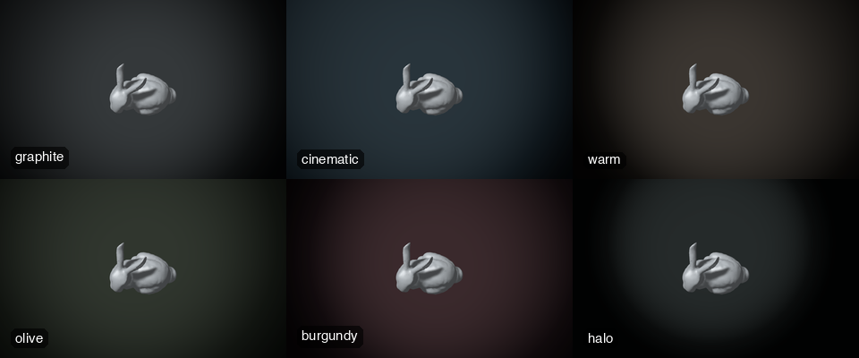
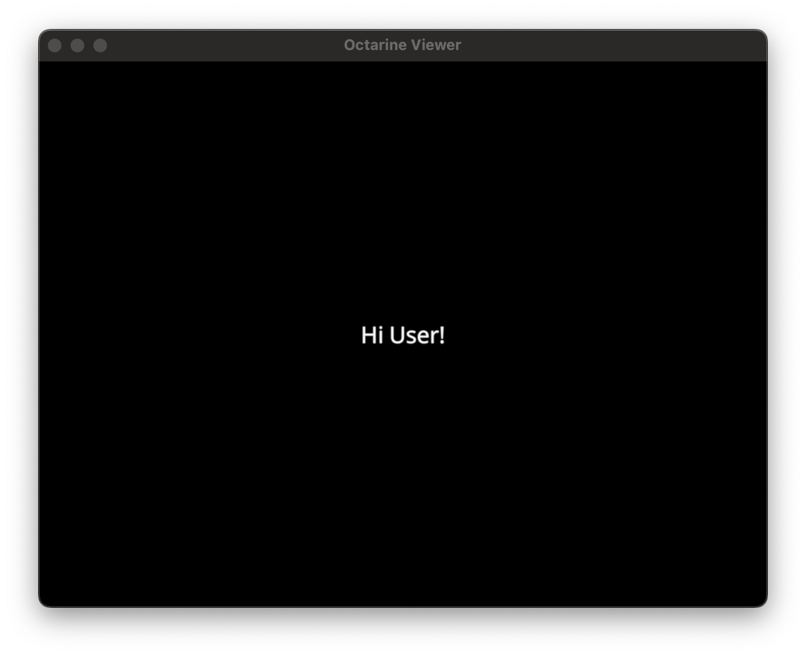
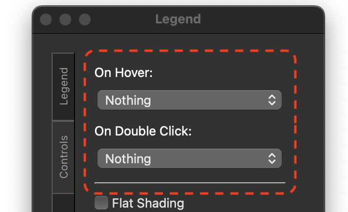

# Controlling the Viewer

In [The Basics](intro.md), you already learned how to open a new
[`octarine.Viewer`][] and add a simple mesh, and [Managing Objects](manage.md)
showed you how to inspect and access objects on the viewer.

Here we will demonstrate various ways to programmatically control the viewer.

## Closing the viewer
Use [`octarine.Viewer.close`][]`()` to close the viewer:

```python
>>> import octarine as oc
>>> v = oc.Viewer()
>>> v.close()
```

## Adjust size
Use [`octarine.Viewer.resize`][]`()` to adjust the size of the viewer:

```python
>>> v = oc.Viewer()
>>> v.resize((1000, 1000))
```

## Camera
Use [`octarine.Viewer.center_camera`][]`()` to center the camera onto objects in the scene:

```python
>>> v = oc.Viewer()
>>> v.center_camera()
```

Use [`octarine.Viewer.set_view`][]`()` to set the camera view:

```python
>>> v = oc.Viewer()
>>> v.set_view('XY')  # set view to frontal
```

Found a nice view? You can save the camera state and re-apply later to get the exact same
view again:

```python
>>> state = v.get_view()  # get the current view
>>> v.set_view(state)  # re-apply the view
```

### Linking viewers

Comparing two things side by side is much easier if they move together. Use
[`octarine.Viewer.link`][]`()` to keep the camera synchronised between viewers:

```python
>>> v1 = oc.Viewer()
>>> v2 = oc.Viewer()
>>> v1.link(v2)
```

From now on, panning, rotating or zooming in either viewer does the same in the
other. The same goes for [`octarine.Viewer.set_view`][]`()` and
[`octarine.Viewer.center_camera`][]`()` (including the implicit centering when
you add objects) - but not for changes you make directly on the `Viewer.camera`
object. On linking, the other viewer immediately adopts the view of the viewer
you called `link()` on.

Links are symmetrical and transitive: linking `v1` to `v2` and then `v2` to `v3`
means that all three move together. You can also link several viewers in one go:

```python
>>> v1.link(v2, v3)
```

Use [`octarine.Viewer.unlink`][]`()` to break the link again. Without arguments
it removes the viewer itself from its group (leaving the others linked with each
other); with arguments it removes the given viewers:

```python
>>> v1.unlink(v3)  # v3 moves on its own again, v1 and v2 stay linked
>>> v1.unlink()  # v1 moves on its own again too
```

The [`octarine.Viewer.linked`][] property tells you who a viewer is currently
linked with.

!!! note "Partial links"

    Sometimes you only want to share *part* of the camera state - e.g. rotate
    in lockstep but zoom into each viewer separately. Use the `sync` or
    `exclude` parameters for that. The three interactive controls map onto
    `"position"` (panning), `"rotation"` (rotating) and `"width"` + `"height"`
    (zooming):

    ```python
    >>> v1.link(v2, sync='rotation')  # only rotate together
    >>> v1.link(v2, exclude=['width', 'height'])  # everything but the zoom
    ```

Viewers don't have to show the same data, use the same controls or even be of
the same camera type: linking an orthographic with a perspective viewer works
fine, the field of view simply stays out of the sync.

## Colors
Use [`octarine.Viewer.colorize`][]`()` to randomize colors:

```python
>>> v = oc.Viewer()
>>> v.colorize(palette='seaborn:tab10')
```

Use [`octarine.Viewer.set_colors`][]`()` to set colors for given objects:

```python
>>> v = oc.Viewer()
>>> v.add(cube, name='cube')
>>> v.set_colors('w')  # set color for all objects
>>> v.set_colors({'cube': 'r'})  # set colors for individual objects
```

## Background

Use [`octarine.Viewer.set_bgcolor`][]`()` to change the background color:

```python
>>> v = oc.Viewer()
>>> v.set_bgcolor("white")
```

Pass two or four colors for a linear gradient - two run bottom to top, four
set the bottom left, bottom right, top left and top right corner:

```python
>>> v.set_bgcolor("black", "#1B2838")
```

For something more photographic there is
[`octarine.Viewer.set_bg_gradient`][]`()`: a radial "studio" gradient, i.e. a
soft pool of light behind the object that fades into near-black towards the
edges of the frame. `Octarine` ships a handful of presets:

```python
>>> v.set_bg_gradient("graphite")  # the default
```

| Preset      | Description                                            |
|-------------|--------------------------------------------------------|
| `graphite`  | Neutral studio grey; the all-rounder (default)         |
| `cinematic` | Desaturated blue-black; dark metals, tech, sci-fi      |
| `warm`      | Warm charcoal; flatters brass, bronze, wood, leather   |
| `olive`     | Muted olive; organic and natural materials             |
| `burgundy`  | Dusty burgundy; editorial/photographic                 |
| `halo`      | Near-black halo; dramatic, minimal                     |



The presets are just starting points - each of the parameters can be
overridden (see [`octarine.Viewer.set_bg_gradient`][] for details):

```python
>>> # Move the light pool to the right and tighten it
>>> v.set_bg_gradient("cinematic", center=(0.65, 0.4), radius=0.5)

>>> # Or roll your own: (inner, mid, outer) colors
>>> v.set_bg_gradient(colors=("#3A292C", "#180F12", "#070405"), vignette=0.4)
```

Note that the gradient is fixed to the canvas: it does not move with the
camera, and `radius` is relative to the canvas *width* so the shape of the
pool does not change when you resize the window. Use `set_bg_gradient(None)`
(or `set_bgcolor("black")`) to go back to a plain background.

The presets are also available from the `Background` dropdown in the
[GUI controls](#gui-controls) - a gradient you set up via the API shows up
there as "Custom" so you can switch away from it and back again.

## Hotkeys
While the viewer or widget is active you can use a set of hotkeys to control the viewer:

| Hotkey | Description                                  |
|--------|----------------------------------------------|
| `1`    | Set frontal (XY) view                        |
| `2`    | Set dorsal (XZ) view                         |
| `3`    | Set lateral (YZ) view                        |
| `f`    | Show/hide frames per second                  |
| `c`    | Show/hide control panel (requires PySide6)   |

You can bind custom keys using the [`octarine.Viewer.bind_key`][]`()` method:

```python
>>> v = oc.Viewer()
>>> # Bind `x` key to clearing the viewer
>>> v.bind_key(key="x", func=v.clear)
```

## Overlay message

Need to communicate with the user? Try the [`octarine.Viewer.show_message`][]`()`:

```python
>>> v = oc.Viewer()
>>> v.show_message("Hi User!",
...                duration=2,  # fade out after 2s
...                position='center')
```



## Scale bar

Use [`octarine.Viewer.set_scalebar`][]`()` to overlay a scale bar. By default
the bar is dynamically re-sized as you zoom, always showing a "nice" round
number:

```python
>>> v = oc.Viewer()
>>> v.set_scalebar(units="nm")
```

You can also pin it to a fixed size and move it to another corner:

```python
>>> v.set_scalebar(1000, units="nm", position="top-left")
```

To remove it again:

```python
>>> v.set_scalebar(False)
```

!!! note

    Scale bars require an orthographic camera (the default). With a
    perspective camera the scale depends on the distance from the camera and
    a single bar would be meaningless - `set_scalebar` will therefore raise
    an error and an existing bar is hidden if you set `Viewer.camera.fov` to
    a non-zero value.

## Lighting

By default, the scene is lit by two point lights (plus a weak ambient light)
that are fixed in space: a strong one from the front/top/left and a weaker one
from the back. As a consequence, the lighting changes as you move the camera
around - which side of an object is lit depends on where you're looking from.

Set [`octarine.Viewer.headlight`][] to `True` to instead use a single light
that is linked to the camera. Objects are then always lit from the front, no
matter how you rotate the scene:

```python
>>> v = oc.Viewer()
>>> v.headlight = True
```

You can also set this when initializing the viewer:

```python
>>> v = oc.Viewer(headlight=True)
```

The headlight is not exactly head-on but offset slightly to the top-left of the
camera - a light shining exactly along the view direction makes objects look
rather flat. Pass a float or an `(x, y)` / `(x, y, z)` tuple instead of `True`
to switch the headlight on with a different offset (in camera space):

```python
>>> v.headlight = 1        # shorthand for (-1, 1, 0): further to the top-left
>>> v.headlight = (1, -1)  # light from the bottom-right instead
>>> v.headlight = 0        # exactly head-on (flat shading)
```

The offset is remembered when you switch the headlight off and on again.

!!! note

    Use `Viewer._headlight.intensity` to change the headlight's brightness.

The ambient light is independent of this setting. Use `Viewer.lights` to get
all light sources (including the headlight) if you want to fine-tune them:

```python
>>> [light.intensity for light in v.lights]
[0.5, 4.0, 1.0, 4.0]
```

### Shadows

Set [`octarine.Viewer.shadows`][] to `True` to have objects cast shadows onto
each other:

```python
>>> v = oc.Viewer()
>>> v.add_mesh(mesh)
>>> v.shadows = True
```

Shadows have to be rendered from each light's point of view, so the lights and
their shadow cameras are automatically fitted to the scene - and re-fitted
whenever you add or remove objects. That means the two static lights move in
much closer than they normally sit, which slightly changes the shading. The
headlight is unaffected.

!!! note

    Only meshes can *receive* shadows. Lines and points do cast them but are
    never shaded themselves, and volumes take no part in shadows at all.

## GUI Controls

The control panel is organized into four tabs:



- **Legend**: one entry per object with a color button and a visibility
  checkbox. Objects added with a `group` (see
  [Managing Objects](manage.md#grouping-objects)) appear as collapsible
  entries with member counts that can be toggled or colorized as one.
  Use the filter field to search entries by name; hovering over an entry
  highlights the corresponding object in the viewer.
- **Controls**: viewer-wide settings - what happens on hover and
  double-click (see [Selecting Objects](selections.md)), flat
  shading/wireframe for meshes, an FPS counter, lighting (see
  [Lighting](#lighting)) and the [render trigger](triggers.md).
- **Screenshot**: save a screenshot to file (with options for size and a
  transparent background) or copy it straight to the clipboard.
- **Effects**: toggle [silhouette rendering](effects.md#silhouette-rendering)
  and [depth of field](effects.md#depth-of-field) - see
  [Effects & Shading](effects.md).

### Shell/IPython
`Octarine` GUI controls when run from the shell currently
require [PySide6](https://pypi.org/project/PySide6/) to be installed and you
may have to use `%gui qt` when inside `IPython` (recent versions of `Octarine`
will typically run this for you automatically).

To activate them you can either press the `c` hotkey or:

```python
>>> v = oc.Viewer()
>>> v.show_controls()
```

<center></center>

### Jupyter
For GUI controls in Jupyter/lab you won't need any additional dependencies.

To activate them you can either press the `c` hotkey or:

```python
>>> # Show viewer widget with `toolbar=True`
>>> v = oc.Viewer()
>>> v.show(toolbar=True)

>>> #... or do this afterwards
>>> v.show_controls()
```

<center></center>


## What next?

<div class="grid cards" markdown>

-   :material-cube:{ .lg .middle } __Objects__

    ---

    Check out the guide on different object types.

    [:octicons-arrow-right-24: Adding Objects](objects.md)

-   :material-format-font:{ .lg .middle } __Animations__

    ---

    Add movement to the viewer.

    [:octicons-arrow-right-24: Animations](animations.md)

</div>