# Effects & Shading

`Octarine` offers a number of ways to change how the scene is rendered.
They roughly fall into three categories:

1. Per-object material settings: [transparency](#transparency-alpha-modes),
   [silhouette rendering](#silhouette-rendering),
   [subsurface scattering](#subsurface-scattering) and
   [matcaps](#matcap-shading)
2. Lighting: [environment maps](#environment-lighting-ibl)
3. Screen-space post-processing passes applied to the rendered image:
   [`add_effect`](#post-processing-effects),
   [ambient occlusion](#ambient-occlusion),
   [outlines](#outlines),
   [depth of field](#depth-of-field) and
   [tone mapping](#tone-mapping-and-exposure)

Most of what follows requires `pygfx>=0.17` (which is what recent versions
of `Octarine` install anyway).

## Transparency (alpha modes)

Whenever objects are semi-transparent, the renderer has to decide how to
blend their colors with whatever is behind them. `pygfx` (`>=0.13`) handles
this via per-material "alpha modes" and
[`octarine.Viewer.set_alpha_mode`][] provides a high-level interface to
these:

```python
>>> import octarine as oc
>>> v = oc.Viewer()
>>> v.add_mesh(mesh, name='bunny', alpha=0.5)

>>> # Set the alpha mode for all objects...
>>> v.set_alpha_mode('weighted_blend')

>>> # ... or only for specific ones
>>> v.set_alpha_mode('add', objects=['bunny'])
```

See `pygfx.Material.alpha_mode` (e.g. via `help()`) for the available
modes. Note that `Octarine` will automatically pick a sensible alpha mode
when you change an object's opacity: `"add"` for semi-transparent objects,
`"opaque"` otherwise. If you need full control, you can always set
`material.alpha_mode` on individual `pygfx` objects.

## Silhouette rendering

[`octarine.Viewer.set_silhouette`][] enables
[Neuroglancer](https://github.com/google/neuroglancer)-style silhouette
rendering for meshes: face-on regions become transparent while edges and
creases are emphasized, giving an x-ray-like view of the mesh's outline.

```python
>>> v = oc.Viewer()
>>> v.add_mesh(mesh, name='bunny')

>>> # Enable silhouette rendering for all meshes
>>> v.set_silhouette(2)

>>> # Adjust the strength (typical values are 1-8)
>>> v.set_silhouette(6)

>>> # Disable again
>>> v.set_silhouette(0)
```

{ width="49%" }
{ width="49%" }

Under the hood, fragments are multiplied by
`pow(1 - |dot(normal, view_dir)|, silhouette)` - i.e. the `silhouette`
exponent has the same semantics as Neuroglancer's "silhouette" property.

Use the `objects` parameter to apply the effect to only some meshes. Note
that this only works for meshes with Phong-based materials - other objects
are silently skipped.

You can also enable the effect for a mesh right when adding it:

```python
>>> v.add_mesh(mesh, silhouette=2)
```

## Subsurface scattering

[`octarine.Viewer.set_subsurface`][] makes meshes *translucent*: instead of
stopping at the surface, light is allowed to bleed through it. Regions with
a light behind them glow, and shading eases past the terminator rather than
dropping off abruptly - the look of skin, wax, marble, leaves or thin
neurites.

```python
>>> v = oc.Viewer()
>>> v.add_mesh(mesh, name='bunny')

>>> # Enable scattering for all meshes (typical strengths are 0.5-2)
>>> v.set_subsurface(1.5)

>>> # Tune the look: a warm tint on a fairly thin object
>>> v.set_subsurface(1.5, scatter_color='#c04030', thickness=0.3)

>>> # Disable again
>>> v.set_subsurface(0)
```

{ width="49%" }
{ width="49%" }

Note how the thin parts - the ears, and the rim where the body turns away
from the viewer - light up, while the bulk of the body stays neutral.

Two terms are added on top of the usual Phong shading:

| Parameter | Effect |
|---|---|
| `subsurface` | Master strength; `0` disables the effect entirely |
| `scatter_color` | The color light picks up on its way through the material |
| `thickness` | How much material light has to cross, in `[0, 1]` |
| `distortion` | How far the glow wraps around the silhouette, in `[0, 1]` |
| `falloff` | Exponent of the glow; higher values tighten it around the light |
| `wrap` | How far light bleeds past the terminator, in `[0, 1]` |
| `glow` | A view-independent floor added to the transmission |

The scattering is strongest when a light sits *behind* what you are
looking at, so it pairs well with turning the
[headlight](controls.md#lighting) off. It deliberately ignores shadows:
light that scatters through an object is exactly the light that did not
reach it directly.

!!! note

    `thickness` is a constant across the mesh, not the real local
    thickness of the geometry, so the effect cannot on its own tell a thin
    part from a thick one. In exchange it needs no preprocessing and costs
    no extra render passes.

As with the silhouette, use the `objects` parameter to restrict the effect
to some meshes, and note that it only works for meshes with Phong-based
materials. The two effects compose, in either order.

You can also enable it right when adding a mesh, either as a strength or
as a dict of the parameters above:

```python
>>> v.add_mesh(mesh, subsurface=1.5)
>>> v.add_mesh(mesh, subsurface={'subsurface': 1.5, 'scatter_color': '#c04030'})
```

## Matcap shading

A matcap ("material capture") is a picture of a shaded sphere used as a
lookup table: the surface normal - as seen from the camera - picks a point
on that sphere and its color becomes the color of the pixel. Everything the
sphere shows (the falloff, the highlights, the rim light) comes along with
it, without a single light being evaluated.

This is a staple of scientific and sculpting viewers: surface shape reads
exceptionally well, and the result can't end up under- or overlit.

```python
>>> v = oc.Viewer()
>>> v.add_mesh(mesh, name='bunny')

>>> # Apply a matcap to all meshes
>>> v.set_matcap('clay')

>>> # ... or only to some
>>> v.set_matcap('jade', objects=['bunny'])

>>> # Back to the regular lit materials
>>> v.set_matcap(None)
```

`Octarine` generates its matcaps procedurally, so the presets are recipes
rather than images:

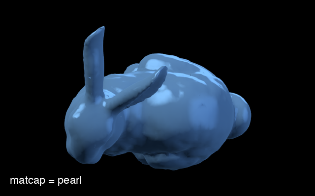{ width="32%" }
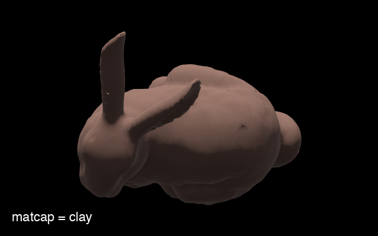{ width="32%" }
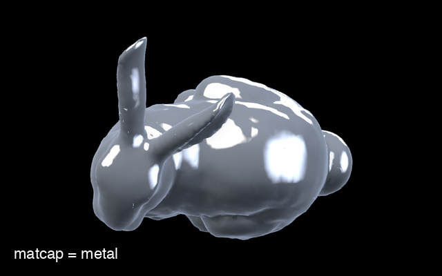{ width="32%" }
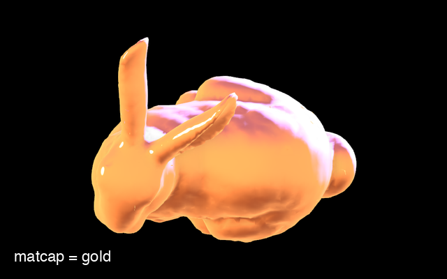{ width="32%" }
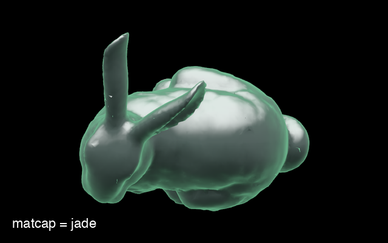{ width="32%" }
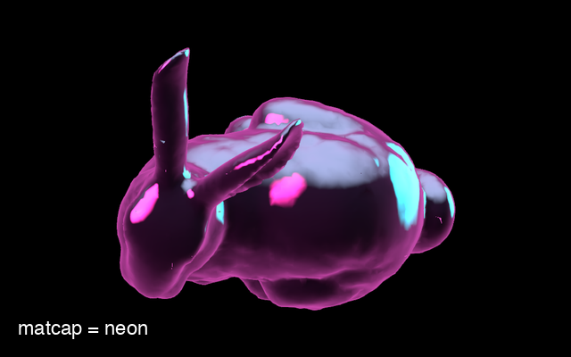{ width="32%" }
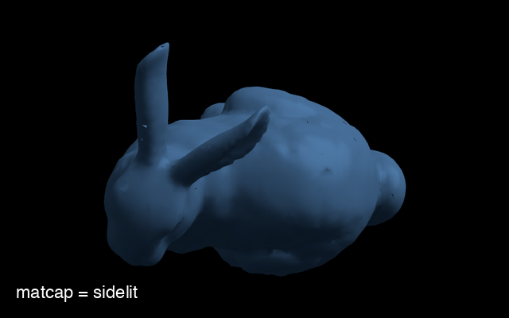{ width="32%" }
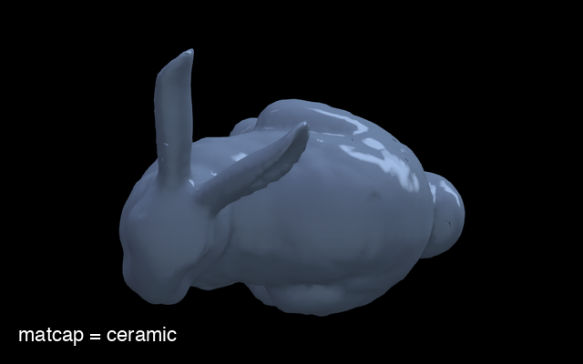{ width="32%" }
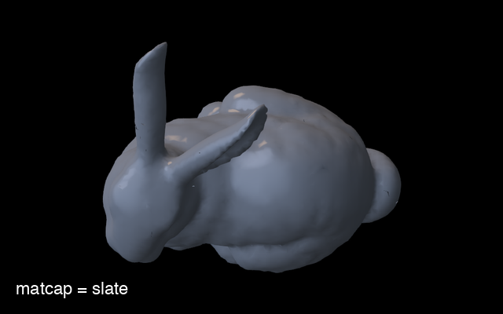{ width="32%" }
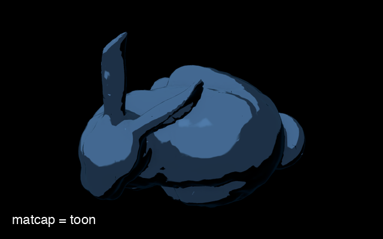{ width="32%" }
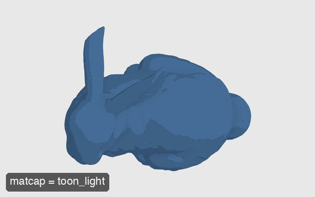{ width="32%" }

| Preset       | Description                                             |
|--------------|---------------------------------------------------------|
| `pearl`      | Neutral glossy white; shape without a color (default)   |
| `clay`       | Matte modelling clay; no highlights, pure form          |
| `metal`      | Brushed steel; hard highlight and a strong rim          |
| `gold`       | Warm polished metal, lit by a low sun                   |
| `jade`       | Deep green stone with a translucent glowing rim         |
| `neon`       | Near-black with magenta/cyan edges; for dark scenes     |
| `sidelit`    | Plain grey under one big side light; very readable      |
| `ceramic`    | Cool glaze with long strip-light reflections            |
| `slate`      | Muted blue-grey ceramic with a small warm key           |
| `toon`       | Cel shading: flat tones and an ink outline              |
| `toon_light` | Pale cel shading, for light backgrounds                 |

The last five are reproductions of matcaps that ship with Blender's
Workbench renderer (`basic_side`, `ceramic_lightbulb`, `ceramic_dark`,
`toon_dark` and `toon_light`). Their parameters were fitted to the
originals rather than copied from them, so they are as close as this model
gets, not pixel-exact matches.

Each preset is a surface description (`base_color`, `specular`,
`shininess`, `rim`, `rim_color`, `rim_power`, and `bands` / `band_softness`
/ `edge` / `edge_width` for the cel-shaded ones) plus the
[environment](#environment-lighting-ibl) its sphere is lit with. That is
usually the *name* of a shared environment - so a matcap and an environment
built from the same preset agree on where the light comes from - but it can
equally be a lighting rig of its own, which is what the Blender-derived
presets use. Every property can be overridden:

```python
>>> v.set_matcap('pearl', base_color='#b0c4de', rim=0.6)
>>> v.set_matcap('metal', environment='sunset')
```

The `tint` parameter controls how much of an object's own color survives.
Tinting keeps differently colored objects distinguishable, which is why the
neutral presets ask for it and the strongly colored ones don't:

```python
>>> v.set_matcap('pearl', tint=1)   # objects keep their colors
>>> v.set_matcap('pearl', tint=0)   # everything takes the matcap's color
```

`bands` quantizes the shading into that many flat tones, which is what
turns a smooth gradient into cel shading, and `edge` draws an ink line
around the silhouette. Both work on any preset:

```python
>>> v.set_matcap('jade', bands=4, band_softness=0, edge=0.8)
```

You can also hand it an image directly - an `(N, M, 3)` or `(N, M, 4)`
array of floats (linear) or `uint8` (sRGB), i.e. what any off-the-shelf
matcap PNG looks like once loaded:

```python
>>> import imageio.v3 as iio
>>> v.set_matcap(iio.imread('some_matcap.png'))
```

A matcap can be set when adding a mesh, too:

```python
>>> v.add_mesh(mesh, matcap='clay')
```

!!! note

    A matcap replaces the material, so it can't be combined with
    `silhouette`, `subsurface` or a custom `shader`. Because the shading is
    locked to the camera it also turns with the view, and matcapped meshes
    take no part in shadows, ambient occlusion or environment lighting.

## Environment lighting (IBL)

A handful of lights leaves surfaces looking flat: every pixel is lit from
two or three directions and from nowhere else. Real objects are lit from
*every* direction - sky, ground, the walls of the room - which is what gives
them their gradients and their reflections. Image-based lighting captures
that by wrapping the scene in an environment map and treating the whole
thing as a light source.

[`octarine.Viewer.set_environment`][] does this with environments it
*synthesizes* rather than HDRI photographs, so nothing has to be
downloaded: each one is a sky gradient plus a few "softboxes".

```python
>>> v = oc.Viewer()
>>> v.add_mesh(mesh)

>>> # Light the scene with the default studio environment
>>> v.set_environment('studio')

>>> # For the full effect, show it and tone map the result
>>> v.set_environment('sunset', show_background=True)
>>> v.set_tonemapping('aces')

>>> # Back to the plain lights
>>> v.set_environment(None)
```

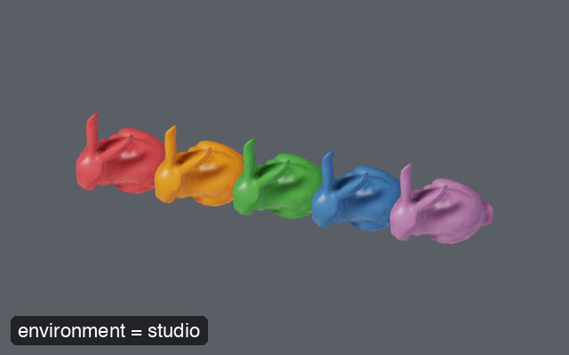{ width="32%" }
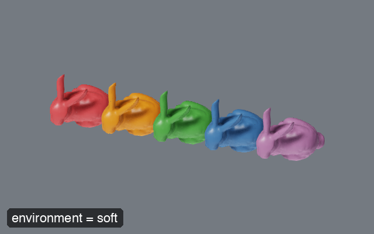{ width="32%" }
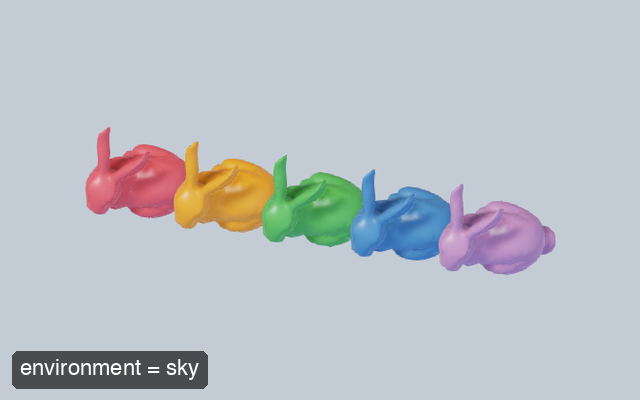{ width="32%" }
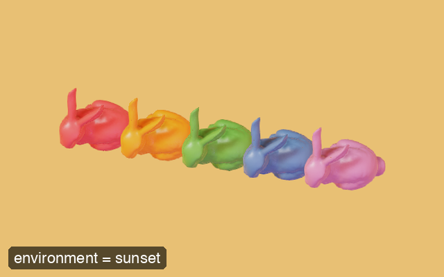{ width="32%" }
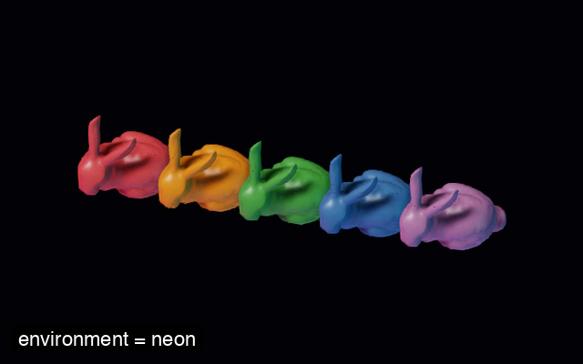{ width="32%" }

| Preset   | Description                                            |
|----------|--------------------------------------------------------|
| `studio` | Neutral three-point studio; the all-rounder (default)  |
| `soft`   | Overcast dome; near-shadowless, for figures            |
| `sky`    | Outdoor daylight; blue zenith, warm sun                |
| `sunset` | Low warm sun against a violet sky; dramatic            |
| `neon`   | Near-black room with magenta/cyan rims; dark scenes    |

The most important parameters:

- `roughness` / `metalness`: the surface the environment is reflected in.
  This is what makes or breaks the look - at `roughness=0.4` (the default)
  the environment shapes the surface visibly; by `0.8` it has flattened out
  again. `metalness=1` makes an object take its color entirely from its
  reflections
- `rotation`: turns the environment about the vertical axis, which moves the
  highlights without having to redefine anything
- `show_background`: also use the environment as the backdrop, so that
  reflections and background agree
- `intensity`: overall brightness of the environment
- `dim_lights`: how far the scene's own lights are dimmed while the
  environment is on (default 0.4); an environment lights a surface from
  every direction at once, so leaving them at full strength washes the image
  out

Presets are starting points - `sky`, `horizon`, `ground`, `gradient` and the
`lights` themselves can all be overridden:

```python
>>> v.set_environment('studio', rotation=90, intensity=1.5)
>>> v.set_environment('neon', roughness=0.15, metalness=0.9)
>>> v.set_environment('soft', ground='#402010')
```

A light is a disc of angular radius `angle` degrees that fades out over the
outer `softness` fraction of itself. Giving it a `length` (also in degrees)
stretches it into a tube - a strip light - and `roll` turns that tube about
its own axis; a glossy surface then shows the long drawn-out streak a real
fixture leaves rather than a round dot:

```python
>>> v.set_environment('studio', roughness=0.15, lights=[
...     dict(direction=(-0.3, 0.9, 0.3), color='#ffffff', intensity=20,
...          angle=3, length=90, roll=0, softness=0.4),
... ])
```

!!! note

    Only physically-based (`shader="standard"` or `"physical"`) meshes can
    be lit by an environment in full, so by default the plain Phong meshes
    `Octarine` creates are converted to PBR ones - pass `pbr=False` to
    prevent that. Meshes with a silhouette, subsurface or matcap material
    keep theirs and receive only a reflection on top of their normal
    shading. Everything is restored by `set_environment(None)`.

!!! tip

    Environments produce values well above white, which are otherwise
    simply clipped. Pair this with [tone mapping](#tone-mapping-and-exposure)
    to see what they are actually doing.

## Post-processing effects

[`octarine.Viewer.add_effect`][] adds a post-processing pass to the
renderer - i.e. an effect applied to the fully rendered image:

```python
>>> v = oc.Viewer()
>>> v.add_mesh(mesh)

>>> # Add Eye-Dome Lighting
>>> v.add_effect('edl')

>>> # Call again to adjust parameters of an existing effect
>>> v.add_effect('edl', strength=8)

>>> # Remove the effect again
>>> v.add_effect('edl', disable=True)
```

Currently supported effects:

| Effect     | Description                                                    | Parameters |
|------------|----------------------------------------------------------------|------------|
| `"edl"`    | Eye-Dome Lighting: darkens edges based on depth differences, enhancing depth perception for complex geometries. | `strength` (default 5), `radius`, `depth_edge_threshold` |
| `"noise"`  | Adds noise to the image.                                       | `noise` (default 0.1) |
| `"fog"`    | Adds fog based on the depth buffer.                            | `color` (default `"#fff"`), `power` (default 1) |
| `"depth"`  | Renders scene depth as shades of grey (near = dark, far = light), normalized to the visible geometry. With `overlay=True` the objects' own colors are kept and darkened with distance instead (depth cueing). | `overlay` (default False), `strength` (default 0.9) |
| `"ao"`     | Screen-space ambient occlusion: darkens creases, cavities and contact points. See [below](#ambient-occlusion). | `radius`, `intensity`, `bias`, `samples`, `power`, `blur`, `debug` |
| `"outline"` | Draws a line around silhouettes and along creases. See [below](#outlines). | `color`, `thickness`, `depth_threshold`, `normal_threshold`, `debug` |
| `"tonemap"` | Compresses the high dynamic range image into what the display can show; also the exposure control. See [below](#tone-mapping-and-exposure). | `mode`, `exposure`, `white_point` |
| `"normal"` | Renders normals reconstructed from the depth buffer.           | - |
| `"bloom"`  | Physically-based bloom: makes bright regions glow.             | `bloom_strength`, `max_mip_levels`, `filter_radius`, `use_karis_average` |

Passes run in a fixed order, whatever order you switch them on in: ambient
occlusion, then outlines, then lens and image effects (depth of field,
bloom, fog, ...), then tone mapping, and finally `pygfx`' own anti-aliasing.
That way a depth-of-field blur blurs the occlusion and the outlines along
with everything else, and the anti-aliasing sees values that have already
been brought into range.

See the [`octarine.Viewer.add_effect`][] reference for details on the
individual parameters.

Here is what these effects look like (click to enlarge; the bloom example
uses `bloom_strength=0.5` to make the effect more obvious):

{ width="49%" }
{ width="49%" }
{ width="49%" }
{ width="49%" }
{ width="49%" }
{ width="49%" }

## Ambient occlusion

Ambient light is applied uniformly, which leaves creases, cavities and the
points where objects touch looking flat.
[`octarine.Viewer.set_ambient_occlusion`][] estimates how much of the
surrounding hemisphere is blocked at each pixel and darkens the image
accordingly:

This is on by default (with a radius derived from the scene) - use
`set_ambient_occlusion` to tune or disable it:

```python
>>> v = oc.Viewer()
>>> v.add_mesh(mesh)

>>> # The radius is what makes or breaks the effect - set it explicitly
>>> # if the automatic one does not suit
>>> v.set_ambient_occlusion(radius=500, intensity=0.8)

>>> # Disable again
>>> v.set_ambient_occlusion(False)

>>> # ... or start without it in the first place
>>> v = oc.Viewer(ambient_occlusion=False)
```

{ width="49%" }
{ width="49%" }

The parameters:

- `radius`: how far to look for occluders, in world units. This is the one
  parameter that has to match the scene - too small and the effect
  disappears, too large and it turns into a dark haze. Defaults to 4% of the
  diagonal of the scene bounds, kept up-to-date as objects are added or
  removed; passing a value pins the radius to it
- `intensity`: strength of the darkening, from 0 to 1
- `bias`: occluders closer to the surface than this fraction of `radius`
  are ignored; raise it if flat surfaces darken themselves, lower it (down
  to 0) for more contrast in tight creases
- `samples`: hemisphere samples per pixel (default 16); more samples mean
  less noise at a higher cost
- `power`: exponent applied to the occlusion; `> 1` restricts the effect to
  the darkest areas, `< 1` spreads it out
- `blur`: radius of the bilateral blur that removes the sampling noise
- `debug`: render the occlusion itself as greyscale - the quickest way to
  find a `radius` that suits the scene

```python
>>> # What is the effect actually seeing?
>>> v.set_ambient_occlusion(debug=True)
```

Occlusion is reconstructed from the depth buffer, which has two
consequences worth knowing:

!!! note

    Like the other post-processing effects this is a screen-space effect:
    it applies to the whole rendered image (including overlay elements such
    as messages), and objects that don't write depth (e.g. meshes with a
    transparent alpha mode) neither cast nor receive occlusion.

!!! note

    Surface orientation is reconstructed from neighbouring depth values,
    which works well for meshes and volumes but not for thin structures -
    points, lines and skeletons have no meaningful surface to occlude. For
    those, [`add_effect('edl')`](#post-processing-effects) is the better
    tool: it darkens by depth difference alone and needs no normals.

The pass costs well under a millisecond per frame at the default sample
count, and runs before the anti-aliasing and any depth of field.

## Outlines

[`octarine.Viewer.set_outline`][] draws a line wherever the geometry has an
edge - around the silhouette of each object, and along the creases within
it - the way a technical illustration would. Beyond looking good, this does
real work in a crowded scene: overlapping objects of similar color become
individually readable, because every one of them is now bounded by a line.

```python
>>> v = oc.Viewer()
>>> v.add_mesh(mesh)

>>> # Enable with default settings (a 1px black line)
>>> v.set_outline()

>>> # A thicker, softer line - and silhouettes only
>>> v.set_outline(color='#0008', thickness=2, normal_threshold=0)

>>> # Disable again
>>> v.set_outline(False)
```

{ width="49%" }
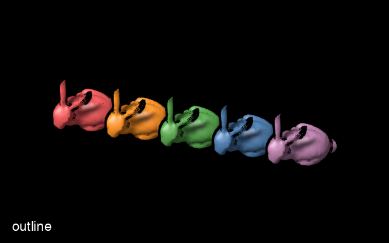{ width="49%" }

The parameters:

- `color`: color of the outline. Its alpha channel doubles as the strength
  of the effect, so `"#0004"` gives a subtle line rather than a hard one.
  White works well on dark backgrounds, black on light ones
- `thickness`: width in physical pixels; above about 4 it starts to look
  chunky rather than drawn
- `depth_threshold`: how far a neighbouring pixel has to lie off the surface
  under the current one to count as a separate object, relative to its
  distance from the camera. Lower it to outline shallower steps, raise it if
  surfaces get outlined across their interior
- `normal_threshold`: how sharply the surface has to fold to count as a
  crease, as `1 - cos(angle)` (0.3 is roughly 45°). 0 outlines silhouettes
  only
- `debug`: render the detected edges as white on black - the quickest way to
  tune the two thresholds

```python
>>> # What is the effect actually seeing?
>>> v.set_outline(debug=True)
```

Rather than comparing raw depth values, the pass asks how far each
neighbouring pixel lies from the *tangent plane* of the surface under the
center pixel. On a smooth surface that distance stays tiny however steeply
the surface is tilted away from the camera, which is what keeps floors and
other grazing surfaces from being outlined along their whole length.

!!! note

    Like the other post-processing effects this is a screen-space effect:
    it applies to the whole rendered image (including overlay elements such
    as messages), and objects that don't write depth (e.g. meshes with a
    transparent alpha mode) are neither outlined nor occlude an outline.

## Depth of field

[`octarine.Viewer.set_depth_of_field`][] adds a photographic focal blur:
objects near the focal plane are rendered sharp while everything closer or
farther is progressively blurred.

```python
>>> v = oc.Viewer()
>>> v.add_mesh(mesh)

>>> # Enable with default settings: continuously auto-focus on
>>> # whatever is at the center of the view
>>> v.set_depth_of_field()

>>> # Stronger blur, eased focus transitions
>>> v.set_depth_of_field(aperture=200, smooth=True)

>>> # Fix the focal plane at a given distance from the camera
>>> v.set_depth_of_field(focus=1000)

>>> # Disable again
>>> v.set_depth_of_field(False)
```

{ width="49%" }
{ width="49%" }

The most important parameters:

- `focus`: distance of the focal plane from the camera in world units; if
  `None` (default) the effect continuously auto-focuses on whatever is at
  the center of the view (over empty space the image is left sharp)
- `aperture`: blur strength - the blur radius in physical pixels of a point
  at 100% relative defocus; typical values are 50-300
- `max_radius`: upper limit for the blur radius in physical pixels
- `smooth`: if truthy, autofocus changes are eased over approximately this
  many seconds (`True` = 0.2s) instead of snapping instantly
- `snap_radius`: autofocus search radius in physical pixels around the view
  center - the effect focuses on the object closest to the view center
  within that radius

!!! note

    Depth of field is a screen-space effect: it applies to the entire
    rendered image (including overlay elements such as messages), and
    objects that don't write depth (e.g. meshes with a transparent alpha
    mode) are blurred by whatever is behind them.

## Tone mapping and exposure

The scene is rendered into a floating point buffer, so colors aren't limited
to `[0, 1]`: highlights, emissive surfaces and anything lit by an
[environment map](#environment-lighting-ibl) routinely go well above white.
Without tone mapping those values are simply clipped, which turns bright
regions into flat white blobs and skews their color - a warm highlight reads
as pure red once the red channel clips and the others haven't yet.

[`octarine.Viewer.set_tonemapping`][] maps that open-ended range onto what
the display can show, rolling the highlights off gradually instead:

```python
>>> v = oc.Viewer()
>>> v.add_mesh(mesh)
>>> v.set_environment('studio')   # gives it something to roll off

>>> v.set_tonemapping('aces')

>>> # `exposure` is the photographic exposure control
>>> v.set_tonemapping('filmic', exposure=1.5)
>>> v.exposure = 2.0              # or set it on its own

>>> # Back to plain clipping
>>> v.set_tonemapping(None)
```

Here is the same (deliberately over-exposed) scene through each curve -
note how the highlights on the bunnies come back:

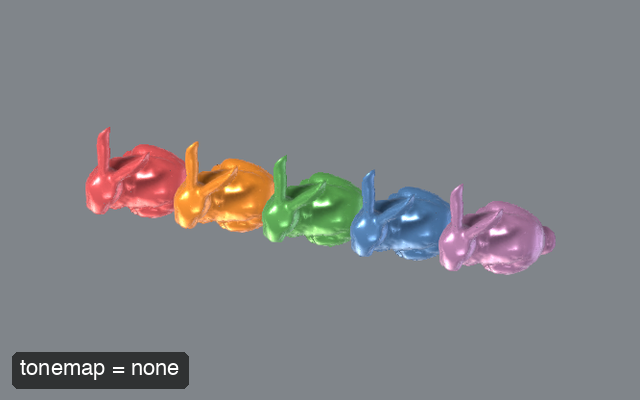{ width="49%" }
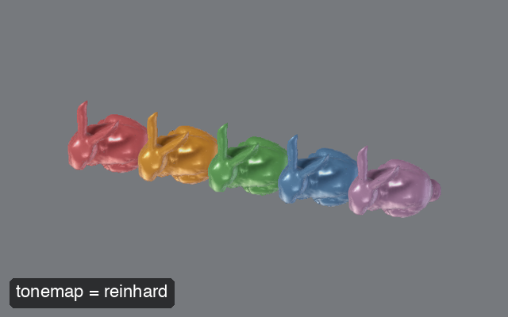{ width="49%" }
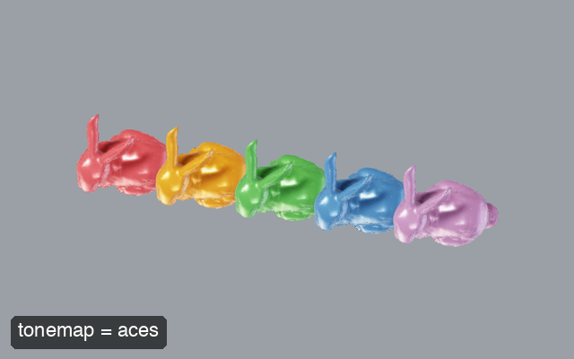{ width="49%" }
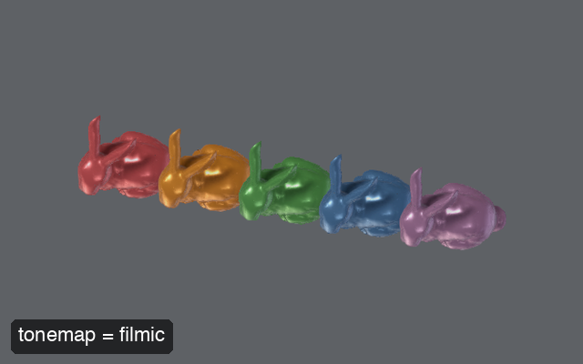{ width="49%" }

| Mode         | Description                                                   |
|--------------|---------------------------------------------------------------|
| `"aces"`     | A fit to the ACES filmic response. Contrasty and saturated; the usual choice (default) |
| `"filmic"`   | Hable's "Uncharted 2" curve. Like ACES but holds on to more shadow detail |
| `"reinhard"` | The gentlest option. Stays closest to the original colors, at the cost of looking flatter |
| `"none"`     | Clip only, i.e. exposure control on its own                   |

`exposure` scales the image *before* the curve is applied: 2 is one stop
brighter, 0.5 one stop darker. Setting [`octarine.Viewer.exposure`][]
switches tone mapping on if it isn't already - without a curve to roll the
highlights off, raising the exposure would only clip them.

`white_point` (used by `"reinhard"` and `"filmic"`) is the input value that
maps to white; raising it holds on to more highlight detail and darkens the
image overall.

!!! note

    Tone mapping runs last - after effects such as bloom, which want the
    untouched high dynamic range values, and before `pygfx`' own
    anti-aliasing and gamma handling, which want display-referred ones.

## Effects in the GUI

All of the above - plus [shadows](controls.md#shadows) and eye-dome lighting
(see [post-processing effects](#post-processing-effects)) - can also be
toggled and tuned interactively from the "Effects" tab of the
[control panel](controls.md#gui-controls). Each effect gets its own section:
the checkbox switches it on, the arrow next to it expands the parameters.

## Under the hood

The custom shaders and render passes powering these features live in the
`octarine.shaders` module - see the [API reference](api/shaders.md). The
module is imported lazily and requires `pygfx>=0.17`.
