# Effects & Shading

`Octarine` offers a number of ways to change how the scene is rendered.
They roughly fall into two categories:

1. Per-object material settings: [transparency](#transparency-alpha-modes)
   and [silhouette rendering](#silhouette-rendering)
2. Screen-space post-processing passes applied to the rendered image:
   [`add_effect`](#post-processing-effects),
   [ambient occlusion](#ambient-occlusion) and
   [depth of field](#depth-of-field)

Most of what follows requires `pygfx>=0.16` (which is what recent versions
of `Octarine` install anyway).

## Transparency (alpha modes)

Whenever objects are semi-transparent, the renderer has to decide how to
blend their colors with whatever is behind them. `pygfx` (`>=0.13`) handles
this via per-material "alpha modes" and
[`octarine.Viewer.set_alpha_mode`][] provides a high-level interface to
these:

```python
>>> import octarine as oc
>>> v = oc.Viewer()
>>> v.add_mesh(mesh, name='bunny', alpha=0.5)

>>> # Set the alpha mode for all objects...
>>> v.set_alpha_mode('weighted_blend')

>>> # ... or only for specific ones
>>> v.set_alpha_mode('add', objects=['bunny'])
```

See `pygfx.Material.alpha_mode` (e.g. via `help()`) for the available
modes. Note that `Octarine` will automatically pick a sensible alpha mode
when you change an object's opacity: `"add"` for semi-transparent objects,
`"opaque"` otherwise. If you need full control, you can always set
`material.alpha_mode` on individual `pygfx` objects.

## Silhouette rendering

[`octarine.Viewer.set_silhouette`][] enables
[Neuroglancer](https://github.com/google/neuroglancer)-style silhouette
rendering for meshes: face-on regions become transparent while edges and
creases are emphasized, giving an x-ray-like view of the mesh's outline.

```python
>>> v = oc.Viewer()
>>> v.add_mesh(mesh, name='bunny')

>>> # Enable silhouette rendering for all meshes
>>> v.set_silhouette(2)

>>> # Adjust the strength (typical values are 1-8)
>>> v.set_silhouette(6)

>>> # Disable again
>>> v.set_silhouette(0)
```

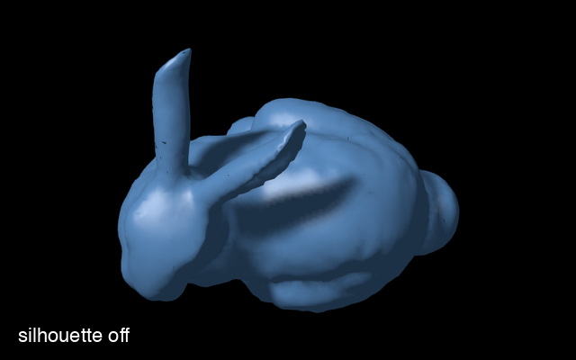{ width="49%" }
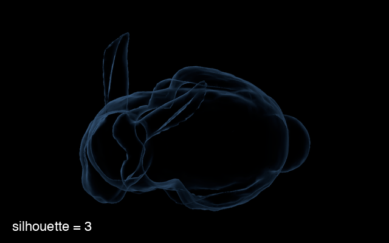{ width="49%" }

Under the hood, fragments are multiplied by
`pow(1 - |dot(normal, view_dir)|, silhouette)` - i.e. the `silhouette`
exponent has the same semantics as Neuroglancer's "silhouette" property.

Use the `objects` parameter to apply the effect to only some meshes. Note
that this only works for meshes with Phong-based materials - other objects
are silently skipped.

You can also enable the effect for a mesh right when adding it:

```python
>>> v.add_mesh(mesh, silhouette=2)
```

## Subsurface scattering

[`octarine.Viewer.set_subsurface`][] makes meshes *translucent*: instead of
stopping at the surface, light is allowed to bleed through it. Regions with
a light behind them glow, and shading eases past the terminator rather than
dropping off abruptly - the look of skin, wax, marble, leaves or thin
neurites.

```python
>>> v = oc.Viewer()
>>> v.add_mesh(mesh, name='bunny')

>>> # Enable scattering for all meshes (typical strengths are 0.5-2)
>>> v.set_subsurface(1.5)

>>> # Tune the look: a warm tint on a fairly thin object
>>> v.set_subsurface(1.5, scatter_color='#c04030', thickness=0.3)

>>> # Disable again
>>> v.set_subsurface(0)
```

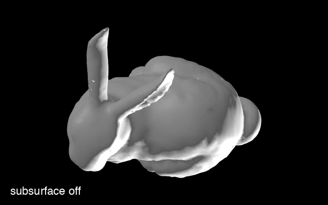{ width="49%" }
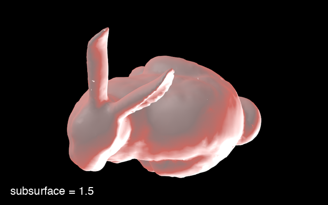{ width="49%" }

Note how the thin parts - the ears, and the rim where the body turns away
from the viewer - light up, while the bulk of the body stays neutral.

Two terms are added on top of the usual Phong shading:

| Parameter | Effect |
|---|---|
| `subsurface` | Master strength; `0` disables the effect entirely |
| `scatter_color` | The color light picks up on its way through the material |
| `thickness` | How much material light has to cross, in `[0, 1]` |
| `distortion` | How far the glow wraps around the silhouette, in `[0, 1]` |
| `falloff` | Exponent of the glow; higher values tighten it around the light |
| `wrap` | How far light bleeds past the terminator, in `[0, 1]` |
| `glow` | A view-independent floor added to the transmission |

The scattering is strongest when a light sits *behind* what you are
looking at, so it pairs well with turning the
[headlight](controls.md#lighting) off. It deliberately ignores shadows:
light that scatters through an object is exactly the light that did not
reach it directly.

!!! note

    `thickness` is a constant across the mesh, not the real local
    thickness of the geometry, so the effect cannot on its own tell a thin
    part from a thick one. In exchange it needs no preprocessing and costs
    no extra render passes.

As with the silhouette, use the `objects` parameter to restrict the effect
to some meshes, and note that it only works for meshes with Phong-based
materials. The two effects compose, in either order.

You can also enable it right when adding a mesh, either as a strength or
as a dict of the parameters above:

```python
>>> v.add_mesh(mesh, subsurface=1.5)
>>> v.add_mesh(mesh, subsurface={'subsurface': 1.5, 'scatter_color': '#c04030'})
```

## Post-processing effects

[`octarine.Viewer.add_effect`][] adds a post-processing pass to the
renderer - i.e. an effect applied to the fully rendered image:

```python
>>> v = oc.Viewer()
>>> v.add_mesh(mesh)

>>> # Add Eye-Dome Lighting
>>> v.add_effect('edl')

>>> # Call again to adjust parameters of an existing effect
>>> v.add_effect('edl', strength=8)

>>> # Remove the effect again
>>> v.add_effect('edl', disable=True)
```

Currently supported effects:

| Effect     | Description                                                    | Parameters |
|------------|----------------------------------------------------------------|------------|
| `"edl"`    | Eye-Dome Lighting: darkens edges based on depth differences, enhancing depth perception for complex geometries. | `strength` (default 5), `radius`, `depth_edge_threshold` |
| `"noise"`  | Adds noise to the image.                                       | `noise` (default 0.1) |
| `"fog"`    | Adds fog based on the depth buffer.                            | `color` (default `"#fff"`), `power` (default 1) |
| `"depth"`  | Renders scene depth as shades of grey (near = dark, far = light), normalized to the visible geometry. With `overlay=True` the objects' own colors are kept and darkened with distance instead (depth cueing). | `overlay` (default False), `strength` (default 0.9) |
| `"ao"`     | Screen-space ambient occlusion: darkens creases, cavities and contact points. See [below](#ambient-occlusion). | `radius`, `intensity`, `bias`, `samples`, `power`, `blur`, `debug` |
| `"normal"` | Renders normals reconstructed from the depth buffer.           | - |
| `"bloom"`  | Physically-based bloom: makes bright regions glow.             | `bloom_strength`, `max_mip_levels`, `filter_radius`, `use_karis_average` |

See the [`octarine.Viewer.add_effect`][] reference for details on the
individual parameters.

Here is what these effects look like (click to enlarge; the bloom example
uses `bloom_strength=0.5` to make the effect more obvious):

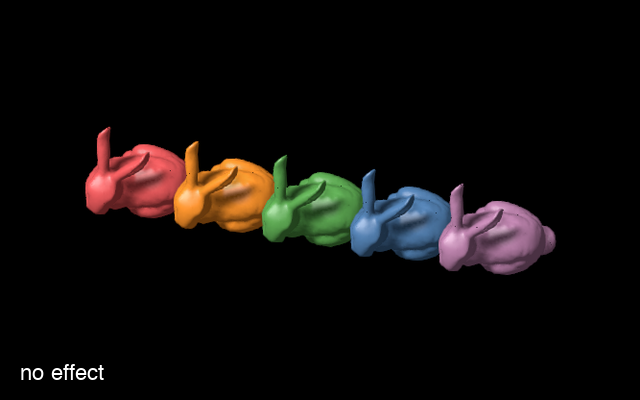{ width="49%" }
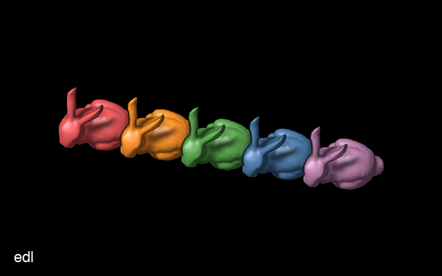{ width="49%" }
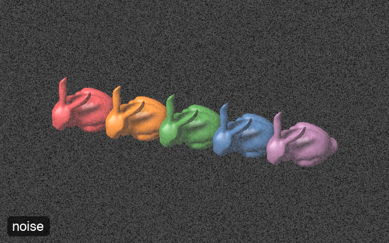{ width="49%" }
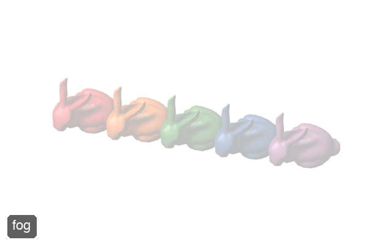{ width="49%" }
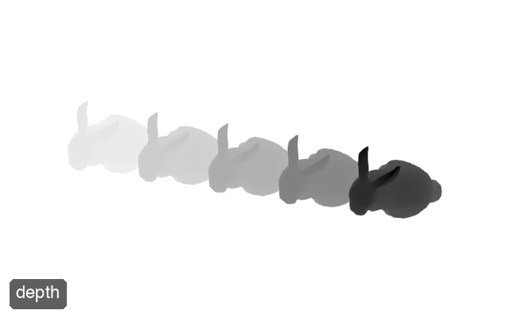{ width="49%" }
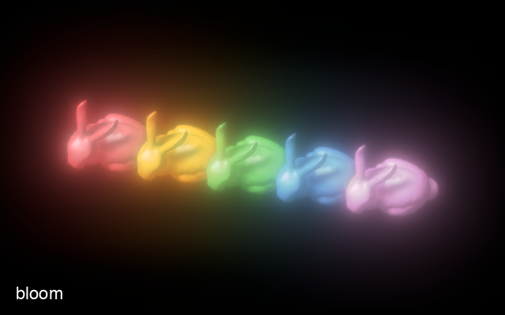{ width="49%" }

## Ambient occlusion

Ambient light is applied uniformly, which leaves creases, cavities and the
points where objects touch looking flat.
[`octarine.Viewer.set_ambient_occlusion`][] estimates how much of the
surrounding hemisphere is blocked at each pixel and darkens the image
accordingly:

This is on by default (with a radius derived from the scene) - use
`set_ambient_occlusion` to tune or disable it:

```python
>>> v = oc.Viewer()
>>> v.add_mesh(mesh)

>>> # The radius is what makes or breaks the effect - set it explicitly
>>> # if the automatic one does not suit
>>> v.set_ambient_occlusion(radius=500, intensity=0.8)

>>> # Disable again
>>> v.set_ambient_occlusion(False)

>>> # ... or start without it in the first place
>>> v = oc.Viewer(ambient_occlusion=False)
```

{ width="49%" }
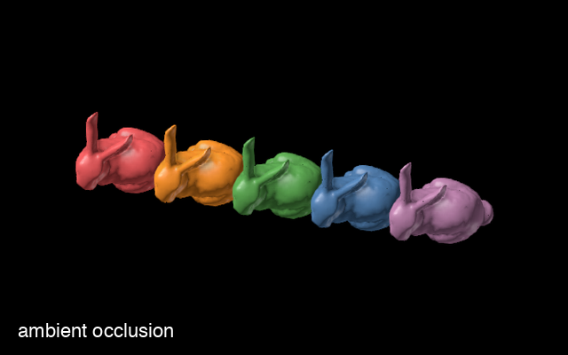{ width="49%" }

The parameters:

- `radius`: how far to look for occluders, in world units. This is the one
  parameter that has to match the scene - too small and the effect
  disappears, too large and it turns into a dark haze. Defaults to 4% of the
  diagonal of the scene bounds, kept up-to-date as objects are added or
  removed; passing a value pins the radius to it
- `intensity`: strength of the darkening, from 0 to 1
- `bias`: occluders closer to the surface than this fraction of `radius`
  are ignored; raise it if flat surfaces darken themselves, lower it (down
  to 0) for more contrast in tight creases
- `samples`: hemisphere samples per pixel (default 16); more samples mean
  less noise at a higher cost
- `power`: exponent applied to the occlusion; `> 1` restricts the effect to
  the darkest areas, `< 1` spreads it out
- `blur`: radius of the bilateral blur that removes the sampling noise
- `debug`: render the occlusion itself as greyscale - the quickest way to
  find a `radius` that suits the scene

```python
>>> # What is the effect actually seeing?
>>> v.set_ambient_occlusion(debug=True)
```

Occlusion is reconstructed from the depth buffer, which has two
consequences worth knowing:

!!! note

    Like the other post-processing effects this is a screen-space effect:
    it applies to the whole rendered image (including overlay elements such
    as messages), and objects that don't write depth (e.g. meshes with a
    transparent alpha mode) neither cast nor receive occlusion.

!!! note

    Surface orientation is reconstructed from neighbouring depth values,
    which works well for meshes and volumes but not for thin structures -
    points, lines and skeletons have no meaningful surface to occlude. For
    those, [`add_effect('edl')`](#post-processing-effects) is the better
    tool: it darkens by depth difference alone and needs no normals.

The pass costs well under a millisecond per frame at the default sample
count, and runs before the anti-aliasing and any depth of field.

## Depth of field

[`octarine.Viewer.set_depth_of_field`][] adds a photographic focal blur:
objects near the focal plane are rendered sharp while everything closer or
farther is progressively blurred.

```python
>>> v = oc.Viewer()
>>> v.add_mesh(mesh)

>>> # Enable with default settings: continuously auto-focus on
>>> # whatever is at the center of the view
>>> v.set_depth_of_field()

>>> # Stronger blur, eased focus transitions
>>> v.set_depth_of_field(aperture=200, smooth=True)

>>> # Fix the focal plane at a given distance from the camera
>>> v.set_depth_of_field(focus=1000)

>>> # Disable again
>>> v.set_depth_of_field(False)
```

{ width="49%" }
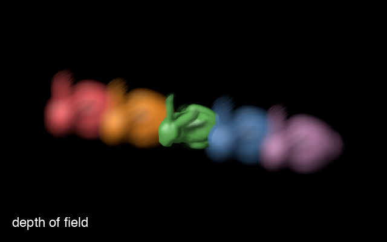{ width="49%" }

The most important parameters:

- `focus`: distance of the focal plane from the camera in world units; if
  `None` (default) the effect continuously auto-focuses on whatever is at
  the center of the view (over empty space the image is left sharp)
- `aperture`: blur strength - the blur radius in physical pixels of a point
  at 100% relative defocus; typical values are 50-300
- `max_radius`: upper limit for the blur radius in physical pixels
- `smooth`: if truthy, autofocus changes are eased over approximately this
  many seconds (`True` = 0.2s) instead of snapping instantly
- `snap_radius`: autofocus search radius in physical pixels around the view
  center - the effect focuses on the object closest to the view center
  within that radius

!!! note

    Depth of field is a screen-space effect: it applies to the entire
    rendered image (including overlay elements such as messages), and
    objects that don't write depth (e.g. meshes with a transparent alpha
    mode) are blurred by whatever is behind them.

## Effects in the GUI

All of the above - plus [shadows](controls.md#shadows) and eye-dome lighting
(see [post-processing effects](#post-processing-effects)) - can also be
toggled and tuned interactively from the "Effects" tab of the
[control panel](controls.md#gui-controls). Each effect gets its own section:
the checkbox switches it on, the arrow next to it expands the parameters.

## Under the hood

The custom shaders and render passes powering these features live in the
`octarine.shaders` module - see the [API reference](api/shaders.md). The
module is imported lazily and requires `pygfx>=0.16`.
