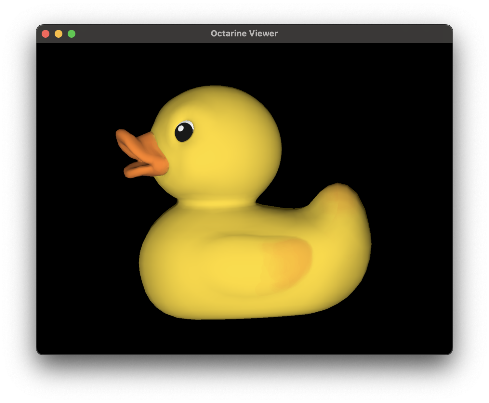
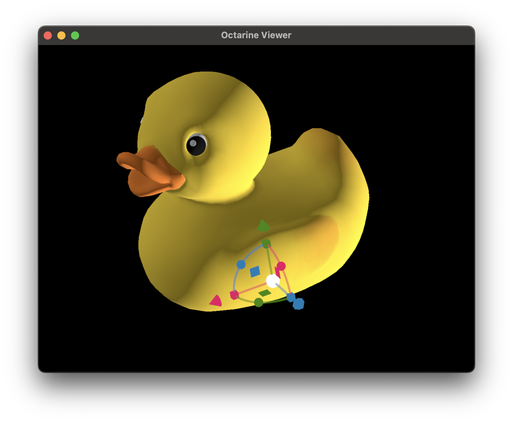

# Managing objects

## Accessing objects

As you add objects to the [octarine.Viewer][], you might want to keep track of
them so you can e.g. colorize or remove them at a later point.

Unless specified, each object gets a generic identifier:

```python
>>> duck = tm.load_remote(
...         'https://github.com/mikedh/trimesh/raw/main/models/Duck.glb'
...     )

>>> # Add the duck
>>> v.add_mesh(duck)
```



Let's check what objects are there:

```python
>>> v.objects
OrderedDict([('Object', [<pygfx.Mesh at 0x37f4f8b90>])])
```

The `.objects` property will return a dictionary mapping IDs to `pygfx` visuals.

Alternatively, you can also do this:

```python
>>> v['Object']
[<pygfx.Mesh at 0x37f4f8b90>]
```

Instead of generic IDs, we can also explicitly set the ID:

```python
>>> v.add_mesh(duck, name='Duck')
>>> v.objects
OrderedDict([('Duck', [<pygfx.Mesh at 0x37f5f8a12>])])
```

This can also be used to combine multiple objects under the same ID.

## Grouping objects

In addition to their ID, objects can be assigned to a `group`:

```python
>>> v.add_mesh(duck, name='Duck', group='Birds')
>>> v.add_mesh(bunny, name='Bunny', group='Mammals')
```

Groups currently serve two purposes:

1. The [`octarine.Viewer.objects_grouped`][octarine.Viewer] property returns
   an ordered dictionary mapping group names to object IDs (ungrouped
   objects are omitted):

    ```python
    >>> v.objects_grouped
    OrderedDict([('Birds', ['Duck']), ('Mammals', ['Bunny'])])
    ```

2. In the [control panel](controls.md#gui-controls), grouped objects appear
   as collapsible legend entries which you can show/hide or colorize as one.

## Modifying objects

Why are the object IDs discussed above relevant? Well, they help you manipulate
objects after they've been added:

```python
>>> v.set_colors({'Duck': 'w'})
>>> v.hide_objects('Duck')
>>> v.remove_objects('Duck')
```

You can also temporarily highlight objects by brightening their color:

```python
>>> v.highlight_objects('Duck')         # brighten by a default amount
>>> v.highlight_objects('Duck', color='red')  # ... or use an explicit color
>>> v.unhighlight_objects()             # remove all highlights
```

## Pinning objects

Pinned objects ignore changes to their color, visibility or transparency:

```python
>>> v.pin_objects('Duck')
>>> v.set_colors('red')   # this will not affect the pinned duck
>>> v.unpin_objects()     # unpin all objects again
```

This is useful when you want to keep e.g. reference objects fixed while
restyling or cycling through the rest. Use the `Viewer.pinned` property to
check which objects are currently pinned.

## Moving objects interactively

You can designate a single object to be moved interactively:

```python
>>> v.moveable_object = "Duck"
```



To remove the transform widget again simple do:

```python
>>> v.moveable_object = None
```


## What next?

<div class="grid cards" markdown>

-   :material-cube:{ .lg .middle } __Objects__

    ---

    Manipulate viewer and objects (color, size, visibility, etc).

    [:octicons-arrow-right-24: Viewer Controls](controls.md)

-   :material-select:{ .lg .middle } __Selection__

    ---

    Selecting objects on the viewer.

    [:octicons-arrow-right-24: Selection](selections.md)

</div>

