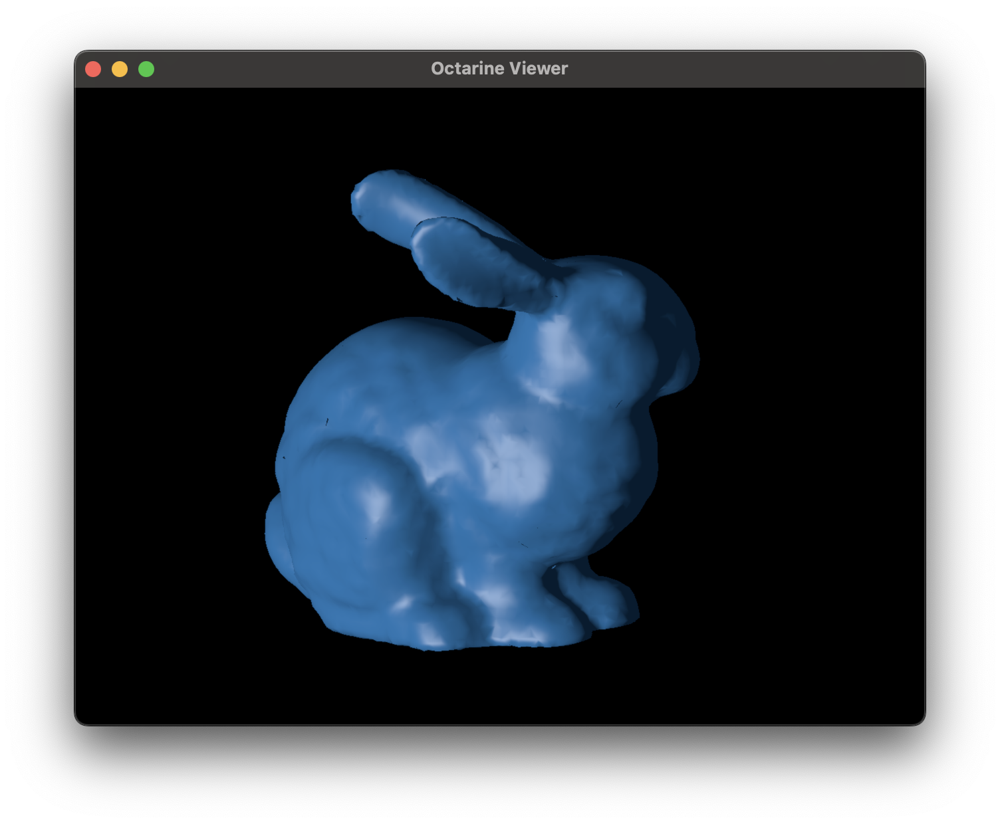

# Adding Objects to the Viewer

Off the bat `Octarine` supports four types of objects all of
which have dedicated `Viewer` methods:

|   | Type          | Viewer method                  |
|---|---------------|--------------------------------|
| 1.| Meshes        | [octarine.Viewer.add_mesh][]   |
| 2.| Points        | [octarine.Viewer.add_points][] |
| 3.| Lines         | [octarine.Viewer.add_lines][]  |
| 4.| Image Volumes | [octarine.Viewer.add_volume][] |

As a general entry point you can use the [octarine.Viewer.add][]`()` method
which will pass an object to the respective specialized function:

```python
>>> v = oc.Viewer()
>>> # This ...
>>> v.add(mesh)
>>> # ... is effectively the same as this
>>> v.add_mesh(mesh)
```
!!! tip

    The specialised methods may offer more ways to customize the visual.

## Meshes

`Octarine` will happily work with anything that's mesh-like - i.e. anything that
has `.vertices` and `.faces`. In practice, I'd recommend you use
[`trimesh`](https://github.com/mikedh/trimesh) to e.g. load meshes from files:

```python
>>> import octarine as oc
>>> import trimesh as tm

>>> mesh = tm.load_remote(
...         'https://github.com/mikedh/trimesh/raw/main/models/bunny.ply'
...     )
>>> type(mesh)
<trimesh.Trimesh(vertices.shape=(8146, 3), faces.shape=(16301, 3), name=`bunny.ply`)

>>> v = oc.Viewer()
>>> v.add_mesh(mesh, name='bunny')
```



## Points

Points are expected to be 2d `(N, 3)` numpy arrays:

```python
>>> import octarine as oc
>>> v = oc.Viewer()

>>> # Add random points as scatter
>>> import numpy as np
>>> points = np.random.rand(10, 3)  # 10 random points
>>> v.add_points(points color='r')
```


## Lines

Lines are expected to be either a `(N, 3)` numpy array
representing a single contiguous line or a list thereof:


```python
>>> import octarine as oc
>>> v = oc.Viewer()

>>> import numpy as np
>>> line1 = np.random.rand(10, 3)  # points for line 1
>>> line2 = np.random.rand(5, 3)  # points for line 2
>>> v.add_lines([line1, line2], color='y')
```


## Image Volumes

Image volumes are expected to be 3d `numpy` arrays or `trimesh.VoxelGrids`.

In this example, we're using [pynrrd](https://pypi.org/project/pynrrd/) to read
an image stack of a _Drosophila_ brain downloaded from figshare
([link](https://figshare.com/s/43ea65ba938e64312f32)):

```python
>>> import nrrd
>>> vol, meta = nrrd.read('JRC2018_UNISEX_38um_iso_16bit.nrrd')
>>> # Dimensions along each axis are 0.38 microns
>>> meta['sizes]
array([[0.38, 0.  , 0.  ],
       [0.  , 0.38, 0.  ],
       [0.  , 0.  , 0.38]])

>>> import octarine as oc
>>> v = oc.Viewer()
>>> v.add_volume(vol, dims=(.38, .38, .38))
>>> v.show_bounds = True
```


## Managing objects

As you add objects to the [octarine.Viewer][], you might want to keep track of
them so you can e.g. colorize or remove them.

Unless specified, each object gets a generic identifier:

```python
>>> duck = tm.load_remote(
...         'https://github.com/mikedh/trimesh/raw/main/models/Duck.glb'
...     )

>>> # Add the duck
>>> v.add_mesh(duck)
```


Let's check what objects are there:

```python
>>> v.objects
OrderedDict([('Object', [<pygfx.Mesh at 0x37f4f8b90>])])
```

The `.objects` property will return a dictionary mapping IDs to `pygfx` visuals.

Alternatively, you can also do this:

```python
>>> v['Object']
[<pygfx.Mesh at 0x37f4f8b90>]
```

Instead of generic IDs, we can also explicitly set the ID:

```python
>>> v.add_mesh(duck, name='Duck')
>>> v.objects
OrderedDict([('Duck', [<pygfx.Mesh at 0x37f5f8a12>])])
```

This can also be used to combine multiple objects under the same ID.

Why are these IDs relevant? Well, they help you manipulate objects after
they've been added:

```
>>> v.set_colors({'Duck': 'w'})
>>> v.hide_objects('Duck')
```

## Custom Objects

What if you have want to visualize something not currently supported
by `Octarine`?

Go check out the [Extending Octarine](extending.md) tutorial to learn how!

