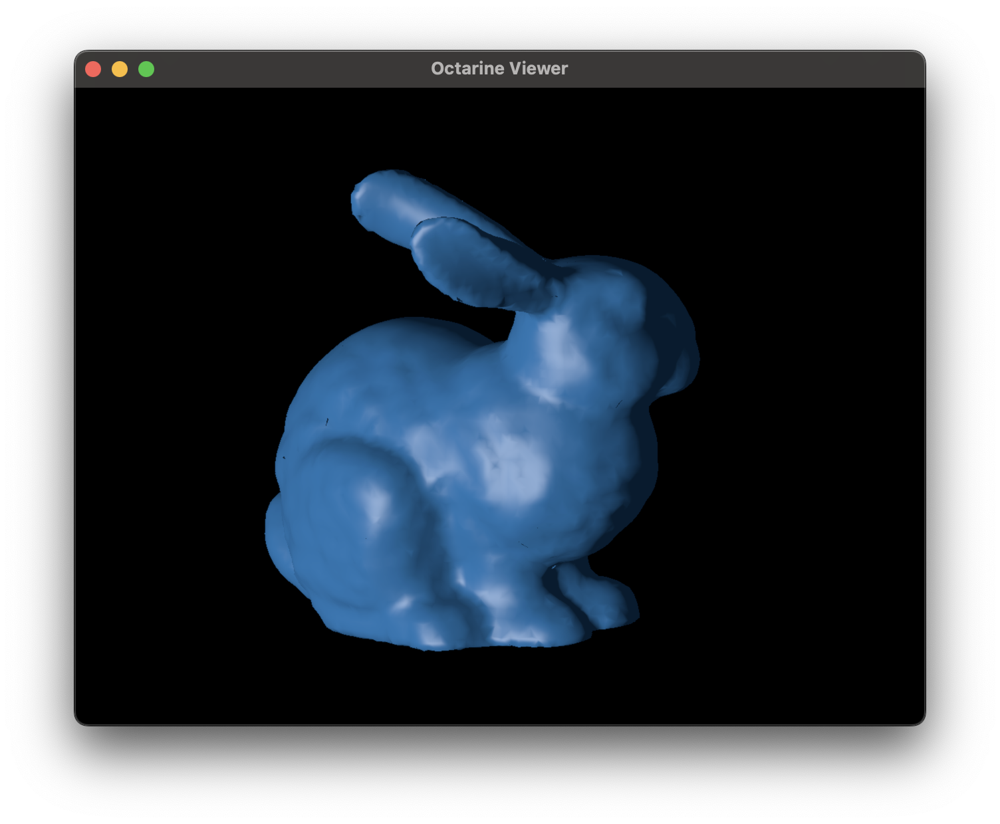
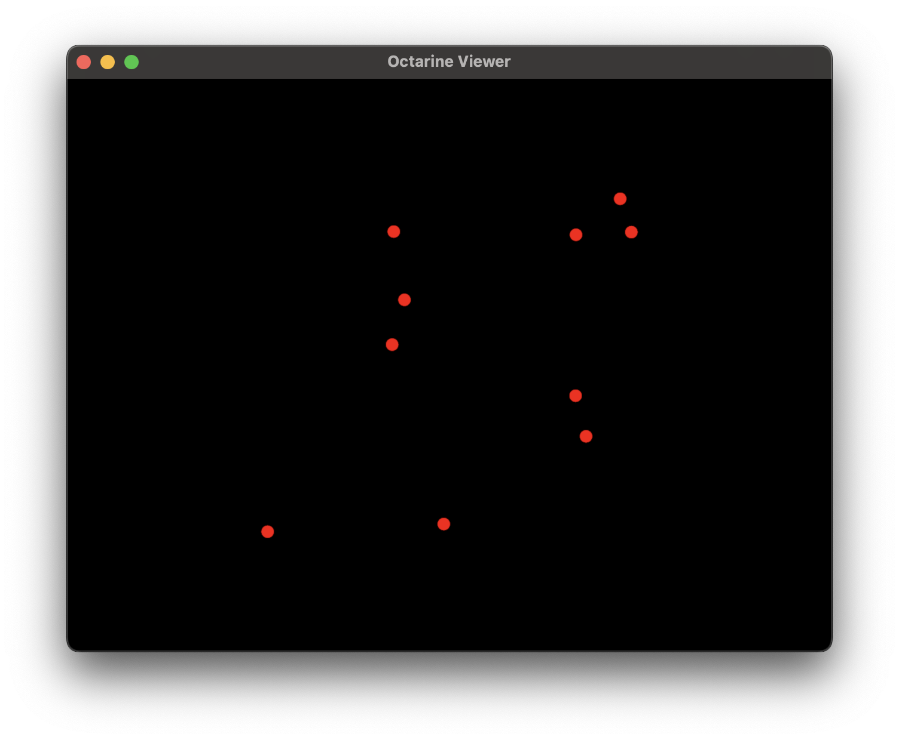
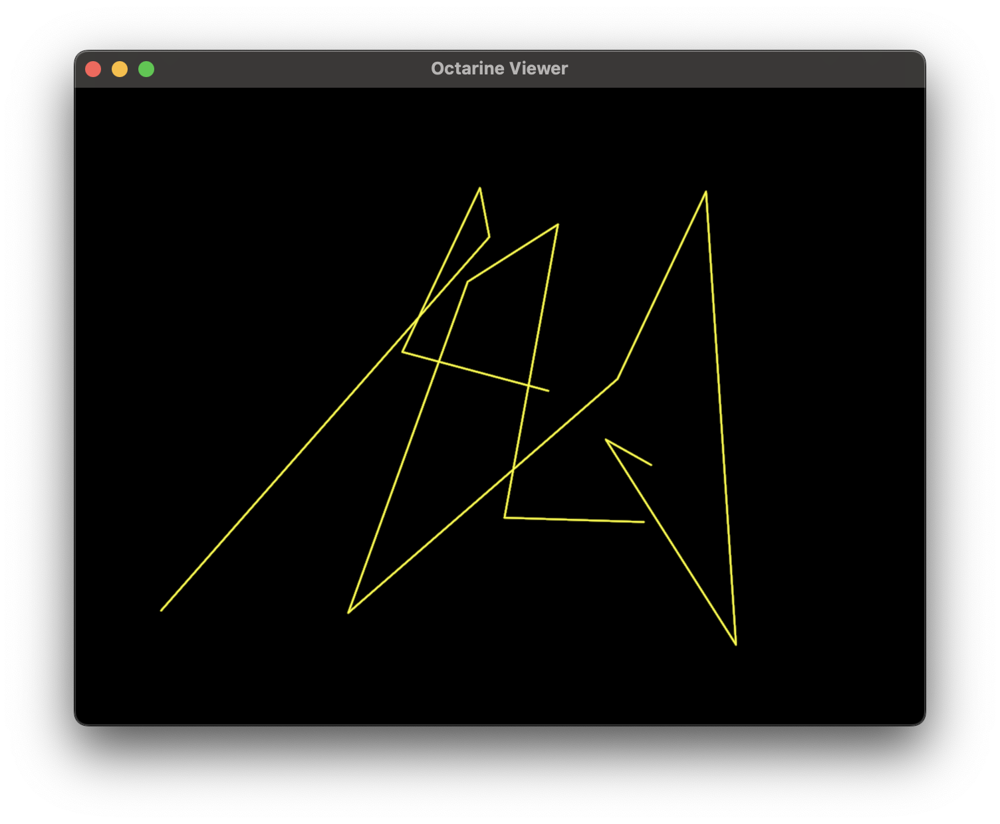
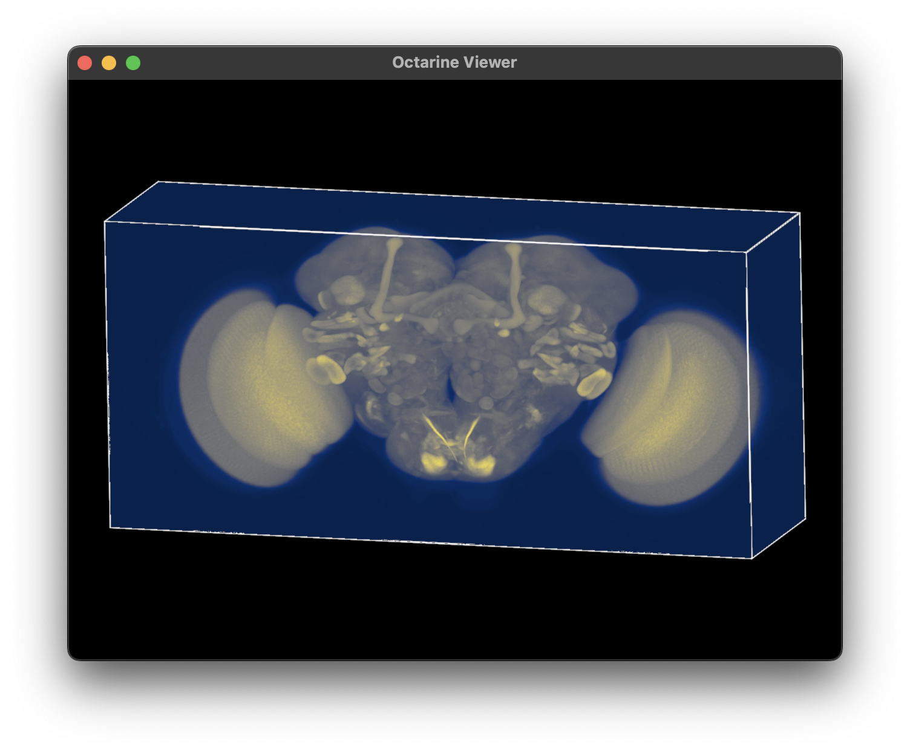
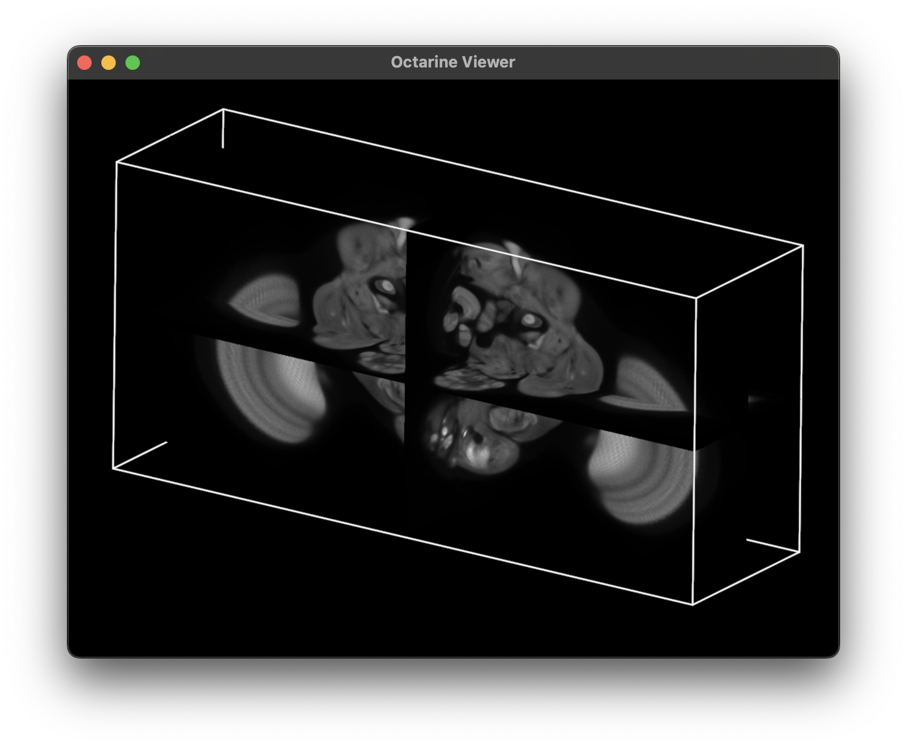

# Adding Objects to the Viewer

Off the bat `Octarine` supports 5 types of objects, all of
which have dedicated `Viewer` methods:

|   | Object Type                       | Viewer method                          |
|---|-----------------------------------|----------------------------------------|
| 1.| [Meshes](#meshes)                 | [octarine.Viewer.add_mesh][]           |
| 2.| [Points](#points)                 | [octarine.Viewer.add_points][]         |
| 3.| [Lines](#lines)                   | [octarine.Viewer.add_lines][]          |
| 4.| [Image Volumes](#image-volumes)   | [octarine.Viewer.add_volume][]         |
| 5.| [Sparse Volumes](#sparse-volumes) | [octarine.Viewer.add_sparse_volume][]  |

As a general entry point you can use the [octarine.Viewer.add][]`()` method
which will pass an object to the respective specialized function:

```python
>>> v = oc.Viewer()
>>> # This ...
>>> v.add(mesh)
>>> # ... is effectively the same as this
>>> v.add_mesh(mesh)
```
!!! tip

    The specialised methods may offer more ways to customize the visual.

## Meshes

`Octarine` will happily work with anything that's mesh-like - i.e. anything that
has `.vertices` and `.faces`. In practice, I'd recommend you use
[`trimesh`](https://github.com/mikedh/trimesh) to e.g. load meshes from files:

```python
>>> import octarine as oc
>>> import trimesh as tm

>>> mesh = tm.load_remote(
...         'https://github.com/mikedh/trimesh/raw/main/models/bunny.ply'
...     )
>>> type(mesh)
<trimesh.Trimesh(vertices.shape=(8146, 3), faces.shape=(16301, 3), name=`bunny.ply`)

>>> v = oc.Viewer()
>>> v.add_mesh(mesh, name='bunny')
```



See [octarine.Viewer.add_mesh][]`()` for details!

## Points

Points are expected to be 2d `(N, 3)` numpy arrays:

```python
>>> import octarine as oc
>>> v = oc.Viewer()

>>> # Add random points as scatter
>>> import numpy as np
>>> points = np.random.rand(10, 3)  # 10 random points
>>> v.add_points(points, color='r')
```



### Markers, sizes and edges

By default, points are rendered as simple squares with a constant on-screen
size. Both of these things can be customized:

```python
>>> v.add_points(
...     points,
...     marker='ring',             # see pygfx.MarkerShape for options
...     size=500,                  # size in world units ...
...     size_space='world',        # ... i.e. markers scale when you zoom
...     min_size=5,                # but keep them at least 5 pixels on screen
...     edge_color='black',        # give the markers ...
...     edge_width=2,              # ... a black edge
...     edge_size_space='screen',  # edge width stays constant on screen
... )
```

A couple notes on the above:

- `marker` accepts the shapes in `pygfx.MarkerShape` - e.g. `"circle"`,
  `"ring"`, `"diamond"`, `"cross"` or `"pin"`
- `size` can be a single value or an array with one size per point
- with `size_space="world"` (or `"model"`), `size` is the marker's _diameter_
  in world (model) units; the default `"screen"` keeps sizes constant in
  on-screen pixels
- `min_size`/`max_size` clamp the on-screen size (in logical pixels):
  "500 world units but at least 5 pixels" keeps far-away points visible
- `edge_mode` controls whether the edge is drawn `"inner"`, `"outer"` or
  `"centered"` (default) relative to the marker's outline

Some of these options (e.g. `min_size`/`max_size` or an edge width in units
different from the marker size) are powered by a custom shader which requires
`pygfx>=0.16`; unless one of them is used, `Octarine` sticks with the stock
`pygfx` materials.

See [octarine.Viewer.add_points][]`()` for details!

## Lines

Lines are expected to be either a `(N, 3)` numpy array
representing a single contiguous line or a list thereof:


```python
>>> import octarine as oc
>>> v = oc.Viewer()

>>> import numpy as np
>>> line1 = np.random.rand(10, 3)  # points for line 1
>>> line2 = np.random.rand(5, 3)  # points for line 2
>>> v.add_lines([line1, line2], color='y')
```



See [octarine.Viewer.add_lines][]`()` for details!

## Image Volumes

Image volumes are expected to be 3d `numpy` arrays or `trimesh.VoxelGrids`.

In this example, we're using [pynrrd](https://pypi.org/project/pynrrd/) to read
an image stack of a _Drosophila_ brain downloaded from figshare
([link](https://figshare.com/s/43ea65ba938e64312f32)):

```python
>>> import nrrd
>>> vol, meta = nrrd.read('JRC2018_UNISEX_38um_iso_16bit.nrrd')
>>> # Dimensions along each axis are 0.38 microns
>>> meta['sizes']
array([[0.38, 0.  , 0.  ],
       [0.  , 0.38, 0.  ],
       [0.  , 0.  , 0.38]])

>>> import octarine as oc
>>> v = oc.Viewer()
>>> v.add_volume(vol, spacing=(.38, .38, .38))
>>> v.show_bounds = True
```



Note that the default blend mode for the renderer may cause objects
behind or inside the volume to look funny. You can change the blend
mode by setting e.g. `v.set_alpha_mode('add')` - see
[Effects & Shading](effects.md#transparency-alpha-modes) for details.

Alternatively, you can also add slices through the volume:

```python
>>> import cmap
>>> v.add_volume(
...     vol,
...     color=cmap.Colormap('Greys'),  # use a different colormap
...     spacing=.38,  # single value for isometric data
...     slice=True  # can also be a tuple, e.g. (True, False, True)
... )
```



See [octarine.Viewer.add_volume][]`()` for details!

## Sparse Volumes

Image volumes work great for dense data but if your data is sparse - e.g.
a segmentation mask or a cloud of voxels - building a dense 3D grid can be
prohibitively expensive. For that, `Octarine` offers
[octarine.Viewer.add_sparse_volume][]`()`: instead of a 3D grid it accepts
an `(N, 3)` array of voxel coordinates (plus optional per-voxel values)
which is rendered with a custom raycasting shader. Its memory footprint
scales with the number of occupied 16³ bricks rather than with the bounding
box, so tens of millions of voxels are feasible:

```python
>>> import numpy as np
>>> import octarine as oc

>>> # Generate some sparse voxel coordinates (a hollow sphere)
>>> phi = np.random.rand(1_000_000) * 2 * np.pi
>>> costheta = np.random.rand(1_000_000) * 2 - 1
>>> theta = np.arccos(costheta)
>>> voxels = np.stack([
...     np.sin(theta) * np.cos(phi),
...     np.sin(theta) * np.sin(phi),
...     np.cos(theta)
... ], axis=1) * 500

>>> v = oc.Viewer()
>>> v.add_sparse_volume(voxels)
```

Useful parameters:

- `values`: per-voxel scalars mapped onto the colormap; without them the
  volume is rendered as binary occupancy
- `mode`: `"mip"` (maximum-intensity projection; default) or `"density"`
  (cloud-like front-to-back emission/absorption)
- `spacing` / `offset`: voxel side lengths and world offset
- `clim`: `(min, max)` range used to scale `values`
- `step_size`: ray-march step in voxels - smaller values miss fewer small
  structures but render slower
- `method`: `"auto"` (default) uses the custom shader and falls back to
  binning into a (downsampled) dense grid if the data occupies too many bricks

You can also wrap the coordinates in a [octarine.VoxelCloud][] - this tells
the generic `Viewer.add` to route them to the sparse-volume pipeline
(a plain `(N, 3)` array would be interpreted as points):

```python
>>> from octarine import VoxelCloud
>>> v.add(VoxelCloud(voxels))
```

Note that sparse volumes require `pygfx>=0.16`.

See [octarine.Viewer.add_sparse_volume][]`()` for details!

## Custom Objects

What if you have want to visualize something not currently supported
by `Octarine`?

Go check out the [Extending Octarine](extending/index.md) tutorial to learn how!

## What next?

<div class="grid cards" markdown>

-   :material-format-font:{ .lg .middle } __Animations__

    ---

    Add movement to the viewer.

    [:octicons-arrow-right-24: Animations](animations.md)

-   :material-camera-control:{ .lg .middle } __Control__

    ---

    Learn how to control the viewer, adjust colors, etc.

    [:octicons-arrow-right-24: Controls](controls.md)

</div>