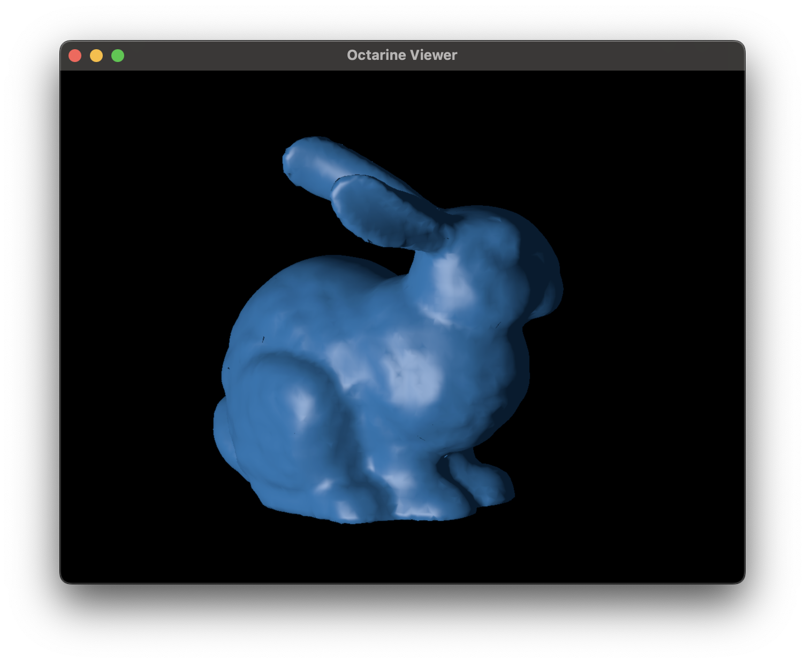
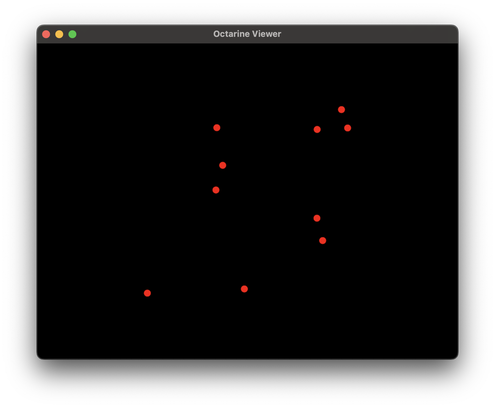
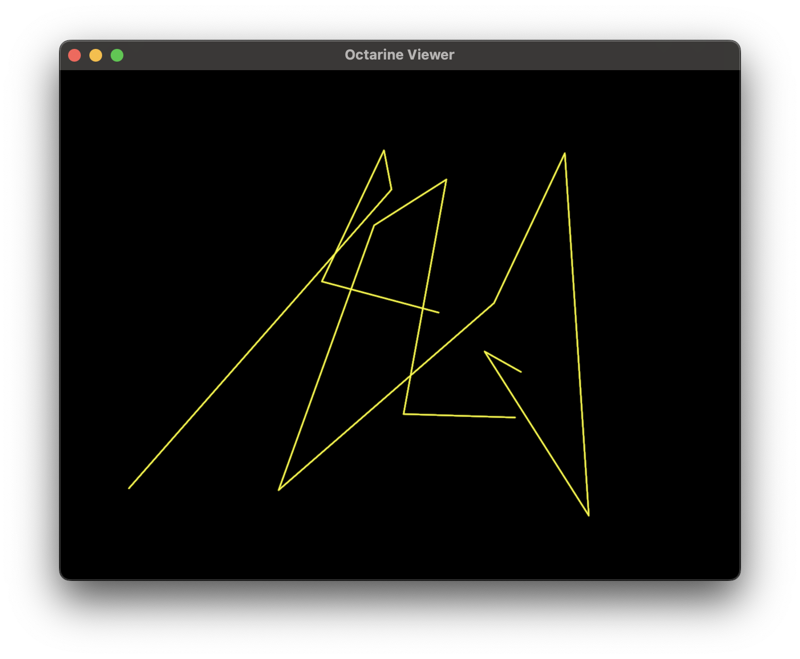
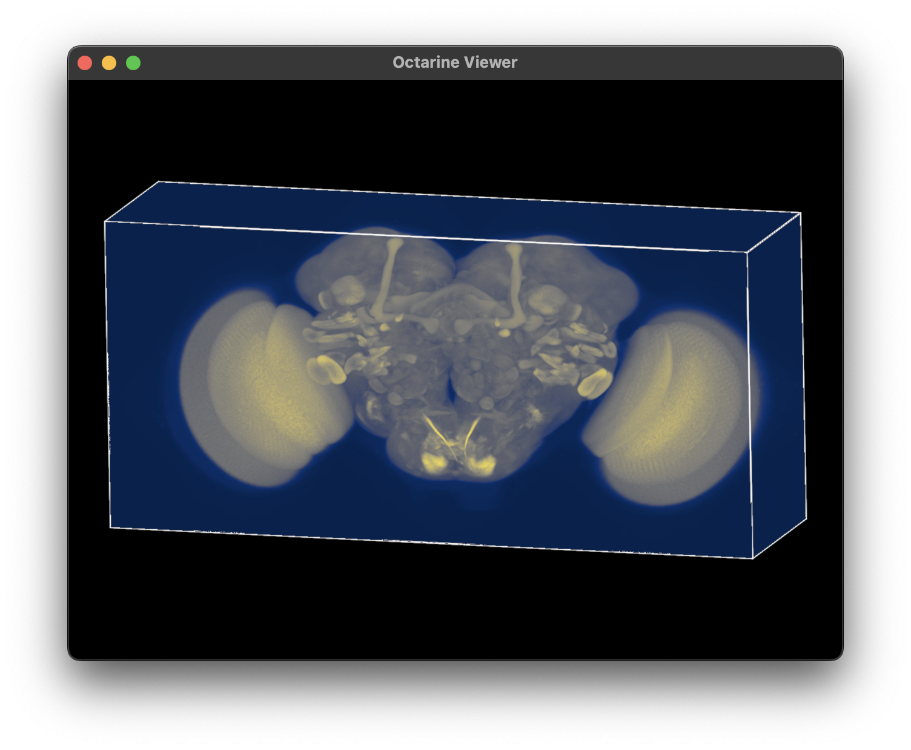
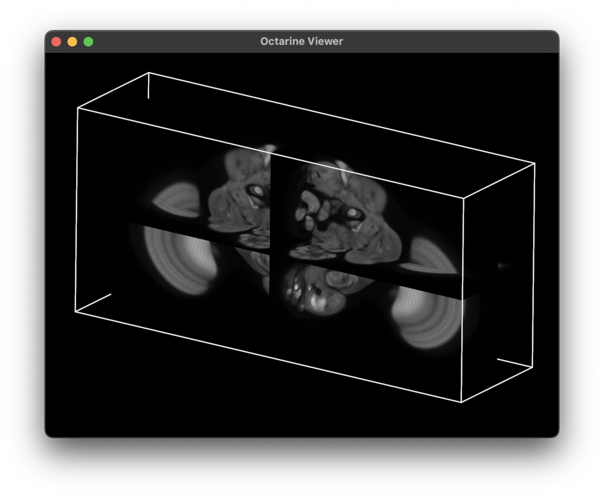

# Adding Objects to the Viewer

Off the bat `Octarine` supports 6 types of objects, all of
which have dedicated `Viewer` methods:

|   | Object Type                       | Viewer method                          |
|---|-----------------------------------|----------------------------------------|
| 1.| [Meshes](#meshes)                 | [octarine.Viewer.add_mesh][]           |
| 2.| [Points](#points)                 | [octarine.Viewer.add_points][]         |
| 3.| [Lines](#lines)                   | [octarine.Viewer.add_lines][]          |
| 4.| [Image Volumes](#image-volumes)   | [octarine.Viewer.add_volume][]         |
| 5.| [Sparse Volumes](#sparse-volumes) | [octarine.Viewer.add_sparse_volume][]  |
| 6.| [Tubes](#tubes)                   | [octarine.Viewer.add_tubes][]          |

As a general entry point you can use the [octarine.Viewer.add][]`()` method
which will pass an object to the respective specialized function:

```python
>>> v = oc.Viewer()
>>> # This ...
>>> v.add(mesh)
>>> # ... is effectively the same as this
>>> v.add_mesh(mesh)
```
!!! tip

    The specialised methods may offer more ways to customize the visual.

## Meshes

`Octarine` will happily work with anything that's mesh-like - i.e. anything that
has `.vertices` and `.faces`. In practice, I'd recommend you use
[`trimesh`](https://github.com/mikedh/trimesh) to e.g. load meshes from files:

```python
>>> import octarine as oc
>>> import trimesh as tm

>>> mesh = tm.load_remote(
...         'https://github.com/mikedh/trimesh/raw/main/models/bunny.ply'
...     )
>>> type(mesh)
<trimesh.Trimesh(vertices.shape=(8146, 3), faces.shape=(16301, 3), name=`bunny.ply`)

>>> v = oc.Viewer()
>>> v.add_mesh(mesh, name='bunny')
```



See [octarine.Viewer.add_mesh][]`()` for details!

## Points

Points are expected to be 2d `(N, 3)` numpy arrays:

```python
>>> import octarine as oc
>>> v = oc.Viewer()

>>> # Add random points as scatter
>>> import numpy as np
>>> points = np.random.rand(10, 3)  # 10 random points
>>> v.add_points(points, color='r')
```



### Markers, sizes and edges

By default, points are rendered as simple squares with a constant on-screen
size. Both of these things can be customized:

```python
>>> v.add_points(
...     points,
...     marker='ring',             # see pygfx.MarkerShape for options
...     size=500,                  # size in world units ...
...     size_space='world',        # ... i.e. markers scale when you zoom
...     min_size=5,                # but keep them at least 5 pixels on screen
...     edge_color='black',        # give the markers ...
...     edge_width=2,              # ... a black edge
...     edge_size_space='screen',  # edge width stays constant on screen
... )
```

A couple notes on the above:

- `marker` accepts the shapes in `pygfx.MarkerShape` - e.g. `"circle"`,
  `"ring"`, `"diamond"`, `"cross"` or `"pin"`
- `size` can be a single value or an array with one size per point
- with `size_space="world"` (or `"model"`), `size` is the marker's _diameter_
  in world (model) units; the default `"screen"` keeps sizes constant in
  on-screen pixels
- `min_size`/`max_size` clamp the on-screen size (in logical pixels):
  "500 world units but at least 5 pixels" keeps far-away points visible
- `edge_mode` controls whether the edge is drawn `"inner"`, `"outer"` or
  `"centered"` (default) relative to the marker's outline

Some of these options (e.g. `min_size`/`max_size` or an edge width in units
different from the marker size) are powered by a custom shader which requires
`pygfx>=0.16`; unless one of them is used, `Octarine` sticks with the stock
`pygfx` materials.

See [octarine.Viewer.add_points][]`()` for details!

## Lines

Lines are expected to be either a `(N, 3)` numpy array
representing a single contiguous line or a list thereof:


```python
>>> import octarine as oc
>>> v = oc.Viewer()

>>> import numpy as np
>>> line1 = np.random.rand(10, 3)  # points for line 1
>>> line2 = np.random.rand(5, 3)  # points for line 2
>>> v.add_lines([line1, line2], color='y')
```



See [octarine.Viewer.add_lines][]`()` for details!

## Image Volumes

Image volumes are expected to be 3d `numpy` arrays or `trimesh.VoxelGrids`.

In this example, we're using [pynrrd](https://pypi.org/project/pynrrd/) to read
an image stack of a _Drosophila_ brain downloaded from figshare
([link](https://figshare.com/s/43ea65ba938e64312f32)):

```python
>>> import nrrd
>>> vol, meta = nrrd.read('JRC2018_UNISEX_38um_iso_16bit.nrrd')
>>> # Dimensions along each axis are 0.38 microns
>>> meta['sizes']
array([[0.38, 0.  , 0.  ],
       [0.  , 0.38, 0.  ],
       [0.  , 0.  , 0.38]])

>>> import octarine as oc
>>> v = oc.Viewer()
>>> v.add_volume(vol, spacing=(.38, .38, .38))
>>> v.show_bounds = True
```



Note that the default blend mode for the renderer may cause objects
behind or inside the volume to look funny. You can change the blend
mode by setting e.g. `v.set_alpha_mode('add')` - see
[Effects & Shading](effects.md#transparency-alpha-modes) for details.

Alternatively, you can also add slices through the volume:

```python
>>> import cmap
>>> v.add_volume(
...     vol,
...     color=cmap.Colormap('Greys'),  # use a different colormap
...     spacing=.38,  # single value for isometric data
...     slice=True  # can also be a tuple, e.g. (True, False, True)
... )
```



See [octarine.Viewer.add_volume][]`()` for details!

## Sparse Volumes

Image volumes work great for dense data but if your data is sparse - e.g.
a segmentation mask or a cloud of voxels - building a dense 3D grid can be
prohibitively expensive. For that, `Octarine` offers
[octarine.Viewer.add_sparse_volume][]`()`: instead of a 3D grid it accepts
an `(N, 3)` array of voxel coordinates (plus optional per-voxel values)
which is rendered with a custom raycasting shader. Its memory footprint
scales with the number of occupied 16³ bricks rather than with the bounding
box, so tens of millions of voxels are feasible:

```python
>>> import numpy as np
>>> import octarine as oc

>>> # Generate some sparse voxel coordinates (a hollow sphere)
>>> phi = np.random.rand(1_000_000) * 2 * np.pi
>>> costheta = np.random.rand(1_000_000) * 2 - 1
>>> theta = np.arccos(costheta)
>>> voxels = np.stack([
...     np.sin(theta) * np.cos(phi),
...     np.sin(theta) * np.sin(phi),
...     np.cos(theta)
... ], axis=1) * 500

>>> v = oc.Viewer()
>>> v.add_sparse_volume(voxels)
```

Useful parameters:

- `values`: per-voxel scalars mapped onto the colormap; without them the
  volume is rendered as binary occupancy
- `mode`: `"mip"` (maximum-intensity projection; default), `"density"`
  (cloud-like front-to-back emission/absorption) or `"surface"` (see below)
- `spacing` / `offset`: voxel side lengths and world offset
- `clim`: `(min, max)` range used to scale `values`
- `step_size`: ray-march step in voxels - smaller values miss fewer small
  structures but render slower

### Surface rendering

`mode="mip"` and `mode="density"` have no notion of a surface: for binary
occupancy data every ray that hits anything returns the same value, so the
volume reads as a flat, homogeneous blob. `mode="surface"` instead stops at
the first isosurface crossing and shades it using the gradient of the volume
as the surface normal, which is what makes the shape legible:

```python
>>> v.add_sparse_volume(voxels, mode="surface")
```

- `threshold` (default `0.5`) sets the level at which the surface sits, as a
  fraction of `clim`. For binary occupancy the default puts it halfway
  between an empty and a full voxel; with `values` it selects an iso-level
- lighting is a fixed headlight, so the surface is always lit from the front

Because the normal is derived from the volume itself, binary data - whose
values jump from 0 to 1 over a single voxel - gives somewhat faceted
normals. The material exposes a few knobs to tune this:

```python
>>> vis = v["SparseVolume.1"][0]
>>> vis.material.gradient_delta = 1.5  # smoother normals, rounder features
>>> vis.material.shininess = 5         # duller specular highlight
>>> vis.material.emissive = "#202020"  # lift the unlit side
```

`gradient_delta` is the half-width (in voxels) of the differences the normal
is derived from. Raising it smooths the voxel staircase on solid, blobby
data but only up to a point: features thinner than the delta fall *between*
the two samples, which flattens their shading. Keep it at the default of `1`
for thin structures such as segmentation shells or skeletons.

Note that `interpolation="nearest"` in surface mode snaps the normals to the
voxel axes, which gives a deliberately blocky, Minecraft-like look.

#### Smoothing

Zoomed in far enough, an isosurface through binary data shows a fine
voxel-scale stipple: the trilinear filter the normal is taken from only
reaches one voxel, so the normal tracks individual voxel faces. The
`smoothing` parameter widens *that filter only*:

```python
>>> v.add_sparse_volume(voxels, mode="surface", smoothing=1.5)
```

It is given in voxels; `0` (the default) is off and `1`-`2` is usually
enough. The isosurface itself stays on the unsmoothed field, so the
silhouette comes out pixel-identical and no thin structures are lost - only
the shading changes. On a 31M-voxel neuron it costs ~4% at close zoom.

!!! note "Why not smooth the surface as well?"

    Because a wider filter shrinks a binary volume. A feature only reaches
    full value while it is thicker than `2 + 2 * smoothing` voxels; below
    that its peak drops away and the isosurface breaks up. At
    `smoothing=1.5` a 2-voxel-thick neurite peaks at 0.51 - right at the
    default threshold. Filtering the normal alone sidesteps that entirely,
    and on real data it looks the same, since it is the shading rather than
    the silhouette that carries the voxel look.

`smoothing` pairs with `gradient_delta`: a difference much narrower than the
filter reads nearly the same value at both taps and yields noise rather than
a direction. The shader therefore widens the stencil along with the filter,
so `gradient_delta` only takes effect once it exceeds `0.5 + smoothing`.

### Density rendering

In `mode="density"` the volume is accumulated front-to-back, so thicker
parts render more opaque. The `density` parameter (default `0.1`) is the
extinction per voxel at the top of `clim`: raise it for a more solid look,
lower it for a wispier one.
- `method`: `"auto"` (default) uses the custom shader and falls back to
  binning into a (downsampled) dense grid if the data occupies too many bricks

### Run-length encoded voxels

`add_sparse_volume` also accepts run-length encoded voxels as an `(N, 4)`
array of `(x, y, z, x_run_length)` - the layout DVID's `sparsevol` endpoint
returns:

```python
>>> import dvid
>>> runs = dvid.get_sparsevol(bodyid, scale=2, voxels=False)   # (N, 4)
>>> v.add_sparse_volume(runs, mode="surface")
```

Runs take a different path through the shader. Coordinates are packed into a
byte-per-voxel atlas that can carry per-voxel `values`; runs are packed into a
**bit-per-voxel bitmask**, which is binary occupancy only but uses roughly
**23x less GPU memory**. On a 31M-voxel DVID neuron:

| | GPU memory | bytes/voxel |
|---|---|---|
| `(N, 3)` coordinates (byte-per-voxel atlas) | 328 MB | 10.5 |
| `(N, 4)` runs (bit-per-voxel bitmask) | 14 MB | 0.45 |

Passing `values` alongside runs raises an error - there is nowhere to put
them. If you have binary `(N, 3)` coordinates and want the same saving, pass
`method="bitmask"` and they will be converted to runs for you.

Note that runs never need expanding: the packer consumes the `(N, 4)` array
directly, so a neuron that would be 376 MB as `(N, 3)` int32 coordinates
never materializes.

You can also wrap the coordinates in a [octarine.VoxelCloud][] (or runs in a
[octarine.VoxelRuns][]) - this tells the generic `Viewer.add` to route them to
the sparse-volume pipeline (a plain `(N, 3)` array would be interpreted as
points):

```python
>>> from octarine import VoxelCloud, VoxelRuns
>>> v.add(VoxelCloud(voxels))
>>> v.add(VoxelRuns(runs))
```

Note that sparse volumes require `pygfx>=0.16`.

See [octarine.Viewer.add_sparse_volume][]`()` for details!

## Tubes

Skeletons with a varying, non-circular cross-section - neuronal arbors,
vessels, streamlines - can be drawn as tubes without ever building a mesh.
[octarine.Viewer.add_tubes][]`()` takes a per-node radial profile

$$r(\theta) = a_0 + \sum_k \left[ a_k \cos(k\theta) + b_k \sin(k\theta) \right]$$

and generates the whole surface in the vertex shader. Each node is 8 + 2K
floats - position, a frame quaternion, the mean radius `a0`, then K cosine
and K sine coefficients - plus an `(E, 2)` edge list. At K = 4 that is 64
bytes a node, whatever resolution you draw it at:

```python
>>> import numpy as np
>>> import octarine as oc

>>> # A straight tube along +x with an elliptic cross-section
>>> n, K = 50, 2
>>> coefs = np.zeros((n, 8 + 2 * K), dtype=np.float32)
>>> coefs[:, 0] = np.linspace(0, 100, n)      # positions
>>> coefs[:, 3:7] = (0.5, 0.5, 0.5, 0.5)      # frame (u, v, t) = (+y, +z, +x)
>>> coefs[:, 7] = 5                           # mean radius a0
>>> coefs[:, 9] = 2                           # a_2: make it elliptic
>>> edges = np.column_stack([np.arange(n - 1), np.arange(1, n)])

>>> v = oc.Viewer()
>>> v.add_tubes(coefs, edges=edges)
```

Useful parameters:

- `axial_lod`: axial level of detail. `0` is full resolution, `1` keeps every
  2nd node, `2` every 4th, and so on. Branch points and tips are always kept,
  so no arm can go missing - see [below](#self-intersection-and-axial_lod)
- `n_theta`: number of angular samples around the tube. This is the angular
  level of detail - 32 is smooth, 8 still gives a reasonable silhouette at a
  quarter of the vertices
- `k`: number of harmonics to evaluate for the surface position; `0` renders
  circular tubes of radius `a0`
- `k_normal`: number of harmonics to evaluate for the *normal* (default `1`,
  clamped to `k`) - see the note below
- `color`: a single color, or an `(M, 3)`/`(M, 4)` array for per-node colors
- `offset`: world offset (node positions are expected in physical units, so
  there is no `spacing`)

### Self-intersection and `axial_lod`

The tube *surface* is generated in the vertex shader by sweeping the
cross-section along the skeleton. It is cheap - the cost is per vertex, and a
coarse `n_theta` makes it cheaper still - and the silhouette is exactly the
profile you gave it.

Its one failure mode is inherent to sweeping: **a swept surface folds through
itself wherever the cross-section radius exceeds the centreline's local radius
of curvature.** Skeletons traced from voxel data routinely violate that, since
node spacing is typically ~1 voxel while radii are several, so a little
positional jitter tilts consecutive rings into one another. The result looks
like a pile of intersecting discs - the classic "why does my tube look like a
crappy mesh".

The fix is to raise `axial_lod` until the axis is smooth relative to the radius
- as a rule of thumb, node spacing of about one radius:

```python
>>> v.add_tubes(coefs, edges=edges, axial_lod=2)
```

This thins the edge list along unbranched runs only; the coefficient buffer is
untouched, so switching level is a small index swap rather than a re-upload.

!!! note "Why `k_normal` defaults lower than `k`"

    The surface normal comes from `dr/dθ`, which weights harmonic *k* by *k*.
    Once the harmonic magnitudes flatten out at the resolution floor of the
    data - which they typically do, with no clear knee - every extra harmonic
    contributes more slope than shape: the silhouette keeps improving while
    the shading gets noisier, until the normal tilts far enough past the view
    direction to leave dark patches. Truncating the normal at `k_normal=1`
    (or `0` for a perfectly smooth tube) keeps the full silhouette and drops
    the sandpaper. Raise it only if you want the roughness.

Both `n_theta` and `k` are uniforms, so changing them re-draws at a different
resolution without touching the coefficient buffer:

```python
>>> vis = v.objects["Tubes"][0]
>>> vis.material.n_theta = 8     # no upload, no reallocation
>>> vis.material.k_normal = 0    # ... and so is smoothing the shading
```

Axial detail is not free in quite the same way: dropping nodes means a
different edge list. That is still only a small index buffer - pass a
decimated `edges` array while the coefficients stay as they are.

`add_tubes` also accepts anything that quacks like a `sparsecubes.TubeProfile`
(i.e. has `a0`, `mag`, `phase`, `frame`, `edges` and `to_gpu_buffer()`), in
which case the coefficients and edges are pulled off the object - and
`Viewer.add` routes such objects here automatically:

```python
>>> v.add(profile)
```

Note that tubes require `pygfx>=0.16`.

See [octarine.Viewer.add_tubes][]`()` for details!

## Custom Objects

What if you have want to visualize something not currently supported
by `Octarine`?

Go check out the [Extending Octarine](extending/index.md) tutorial to learn how!

## What next?

<div class="grid cards" markdown>

-   :material-format-font:{ .lg .middle } __Animations__

    ---

    Add movement to the viewer.

    [:octicons-arrow-right-24: Animations](animations.md)

-   :material-camera-control:{ .lg .middle } __Control__

    ---

    Learn how to control the viewer, adjust colors, etc.

    [:octicons-arrow-right-24: Controls](controls.md)

</div>