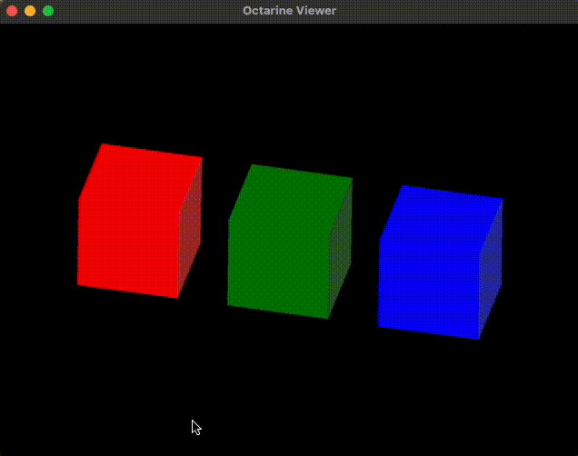
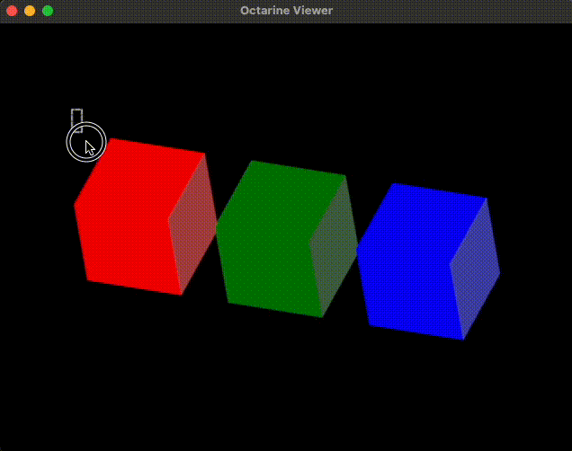

# Selecting objects

In this section you will learn to setup a selection widget to a viewer.

We'll start by importing `octarine` and the [`SelectionGizmo`][octarine.selection.SelectionGizmo]:

```python
import octarine as oc
from octarine.selection import SelectionGizmo
```

Next, we will instantiate the viewer and add a few cubes:

```python
v = oc.Viewer()

# Make 3 cubes that are slightly offset against each other
import pygfx as gfx
for i in range(3):
    color = ['red', 'green', 'blue'][i]
    cube = gfx.Mesh(
        gfx.box_geometry(200, 200, 200),
        gfx.MeshPhongMaterial(color=color),
    )
    cube.local.x = 300 * i
    v.add(cube, name=f"{color} cube")
```


Note that we have given our cubes some useful names:
```python
>>> v.objects
OrderedDict([('red cube', [<pygfx.Mesh  at 0x3565dca10>]),
             ('green cube', [<pygfx.Mesh  at 0x356441f10>]),
             ('blue cube', [<pygfx.Mesh  at 0x14ef4c450>])])
```

Next, we will add a [`SelectionGizmo`][octarine.selection.SelectionGizmo] to the viewer:

```python
# Instantiate the gizmo and link it to our viewer
sel = SelectionGizmo(viewer=v)
```

Now if you hold `Shift` and click & drag on the viewer, you should see a selection rectangle being drawn:



Other than that nothing happens. That's because we haven't told the `SelectionGizmo` what do do
once a selection has been made. For that, we need to attach a callback function that accepts
a dictionary describing the selection. Let's write a little function that just prints the content
of that dictionary and attach as callback:

```python
from pprint import pprint

def print_selection(sel_dict):
    pprint("Selection made:")
    pprint(sel_dict)

sel.add_callback(print_selection)
```

Now if we make a selection, you should see something like this in your console:

```python
'Selection made:'
{'blue cube': {'clipped': False,
               'contained': False,
               'objects': [{'clipped': False,
                            'contained': False,
                            'data': None}]},
 'green cube': {'clipped': True,
                'contained': False,
                'objects': [{'clipped': True,
                             'contained': False,
                             'data': array([False, False, False, False, True, True, True, True, True, False, True, False, False, True, False, True, True, False, True, False, False, True, False, True])}]},
 'red cube': {'clipped': True,
              'contained': True,
              'objects': [{'clipped': True, 'contained': True, 'data': None}]}}
```

If you look closely, you will see that the selection rectangle:

1. missed the blue cube
2. clipped the green cube
3. fully contained the red cube

For the clipped green cube, the dictionary gives us an array (`data`) that tells us which vertices of the
cube were in- (`True`) and which were outside (`False`) of the selection box.

Let's do something more elaborate and add a callback that highlight cubes that we selected:

```python
def highlight_selection(sel_dict):
    # First unhighlight all currently highlighted objects
    v.unhighlight_objects()

    # Now highlight the selected neurons
    v.highlight_objects([ob for ob, props in sel_dict.items() if props['clipped'] is True])

sel.add_callback(highlight_selection)
```

