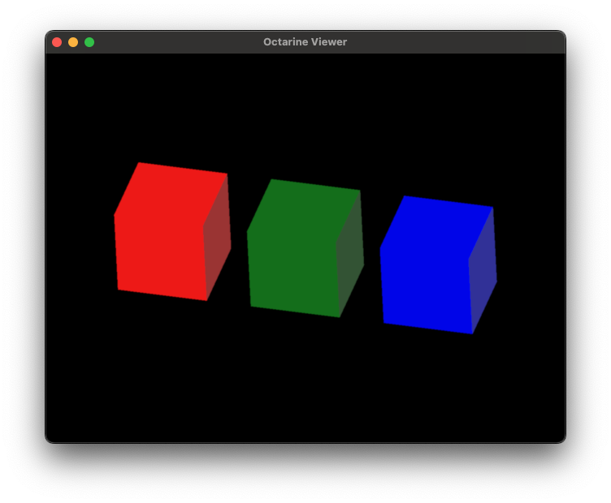
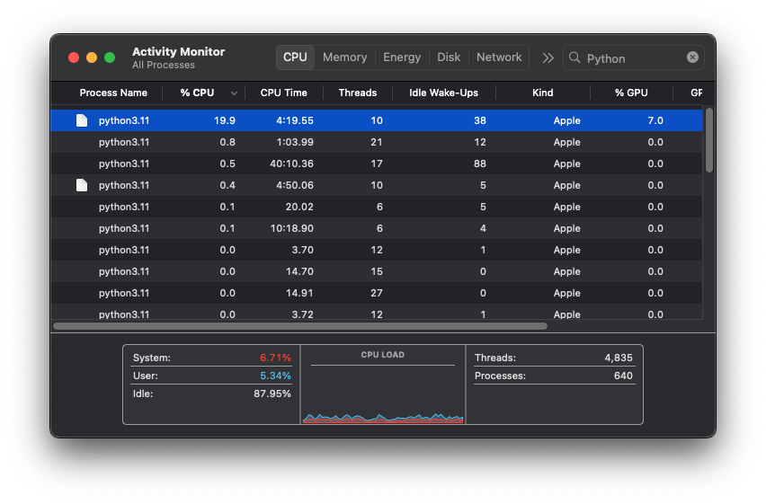
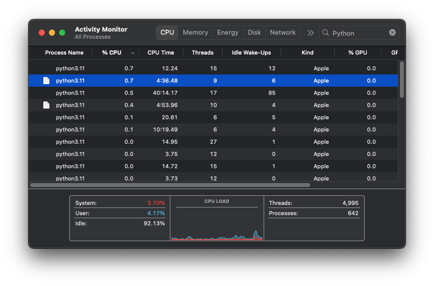

# Render triggers

This vignette will teach you about render triggers and how to make your viewer more efficient.

To illustrate the principle, let's generate this scene:

```python
import octarine as oc

viewer = oc.Viewer()

# Make 3 cubes that are slightly offset against each other
import pygfx as gfx
for i in range(3):
    color = ['red', 'green', 'blue'][i]
    cube = gfx.Mesh(
        gfx.box_geometry(200, 200, 200),
        gfx.MeshPhongMaterial(color=color),
    )
    cube.local.x = 300 * i
    viewer.add(cube, name=f"{color} cube")
```



If you now open your Activity Monitor (OSX), Task Manager (Windows) or whatever your system uses and isolate
the Python process, you may notice that it uses a fair amount of CPU and GPU even though nothing much is
happening:



!!! note
    It's possible that the CPU/GPU usage goes down if the viewer is minimized or covered by other windows.


That's because the `octarine.Viewer` continuously renders new frames up to the maximum frame rate (30 FPS by default).
You can decrease the maximum frame rate by setting `viewer.max_fps = 15` but that will make interacting with the viewer less smooth.

A better solution is to change the render trigger from `continous` to `reactive`:

```Python
viewer.render_trigger = "reactive"
```

This tells the viewer to only trigger rendering of a new frame if the scene has actually changed -
for example when the camera has moved or you added a new object. As a consequence, you should see your CPU/GPU load go
down to almost zero when not interacting with the viewer:



**Important:** Reactive rendering has a few caveats! Because we're not greedily rendering new frames whenever we get the
chance, we have to rely on a complex-ish system of signals that tell our `Viewer` when things have changed and it's time to compute
a new frame. Basic actions will correctly trigger a re-render but if you encounter a situation where the viewer
should update but doesn't, please open an [issue on Github](https://github.com/schlegelp/octarine/issues)!

Also, if you are running e.g. custom animations outside of the `Viewer.add_animations` hook you may have to manually tell the viewer
to re-render by setting `viewer._render_stale = True`.

!!! example "Active window"
    There is a third option, `active_window`, which pauses rendering when the Window isn't active. However, this currently
    only works if you are using the PySide6 backend.
